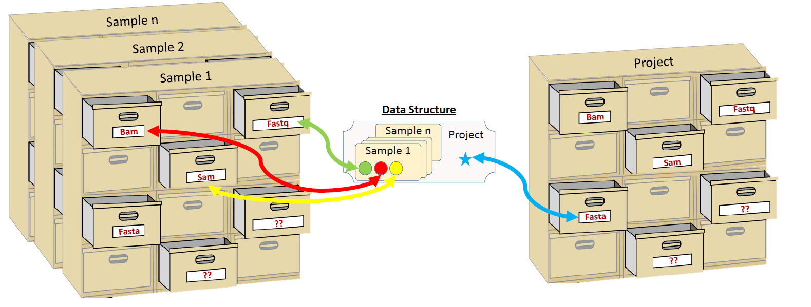
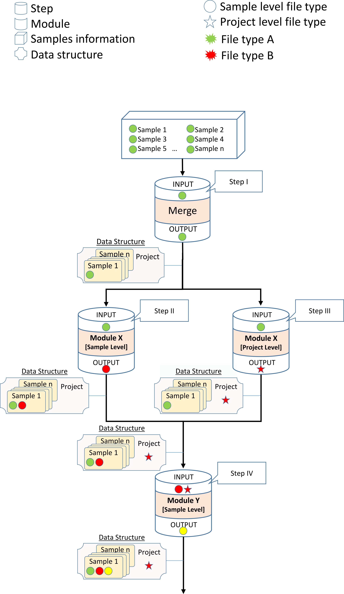
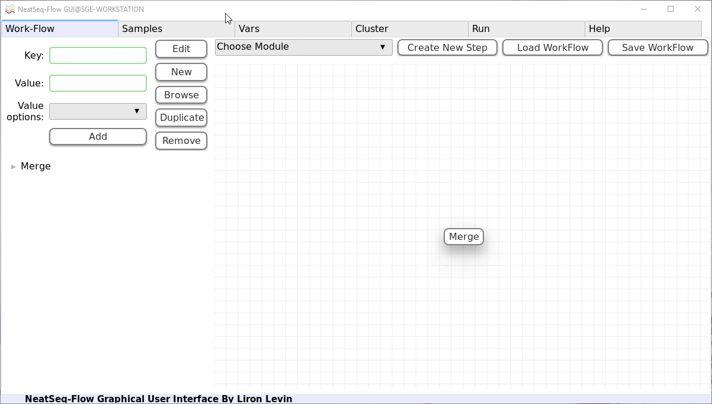
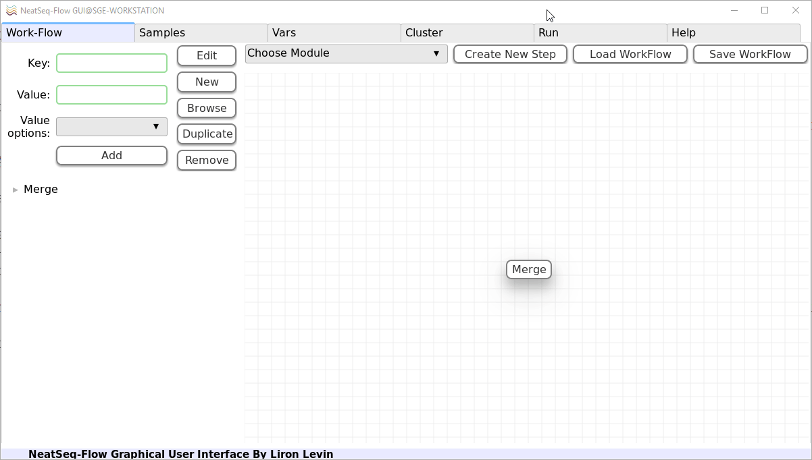
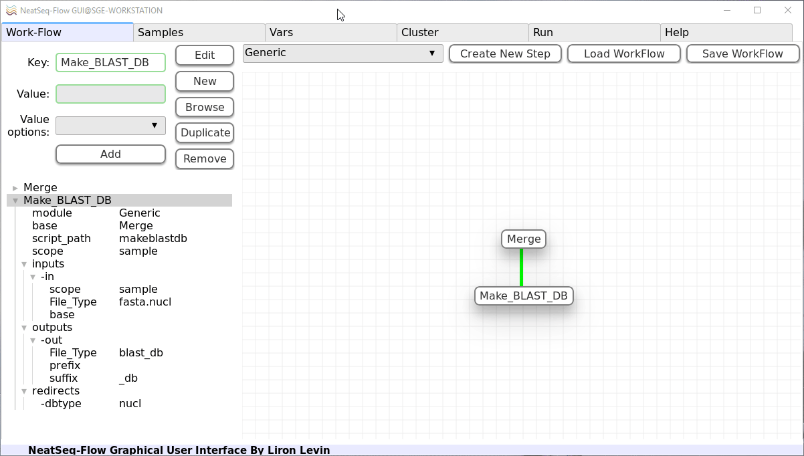
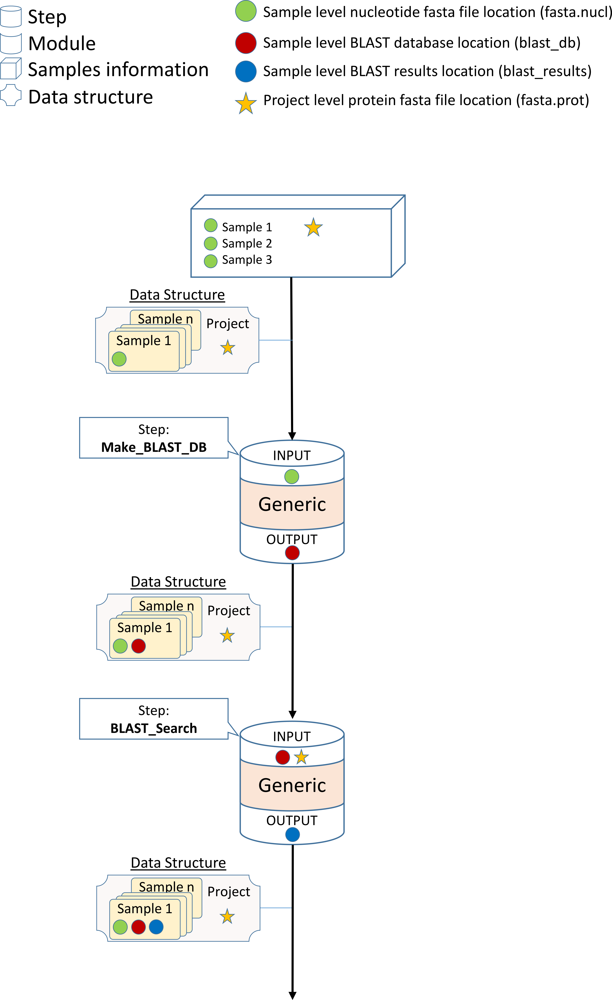
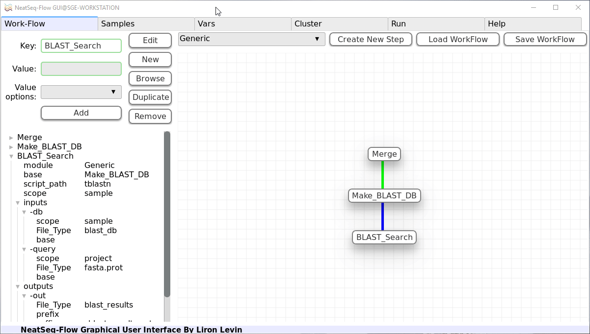
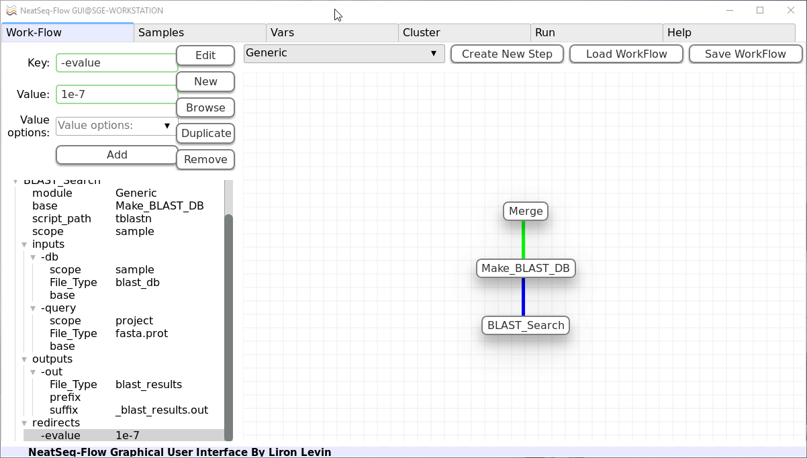
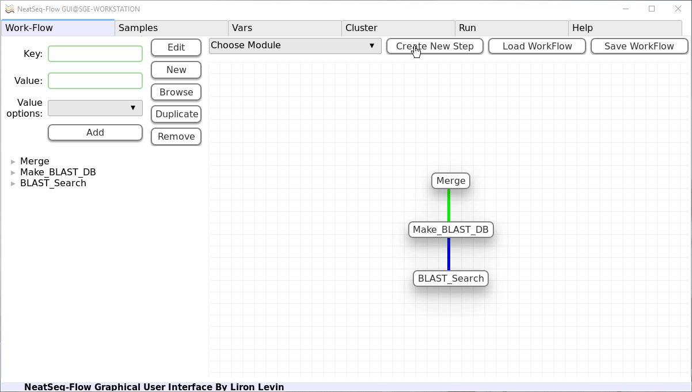
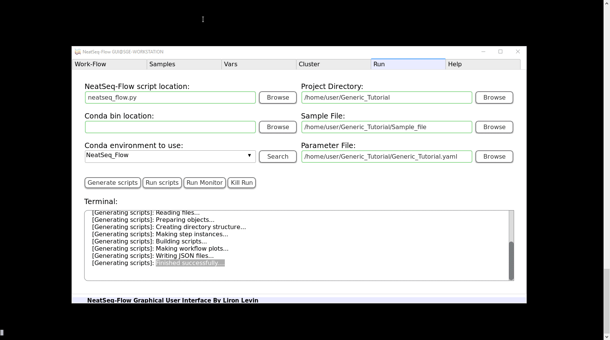

=====================================
Using The Generic Module 
=====================================

:Author: Liron Levin
:Affiliation: Bioinformatics Core Facility
:Organization: National Institute of Biotechnology in the Negev, Ben Gurion University.

.. Note:: In order to use this Tutorial first:

    1. Install `NeatSeq-Flow <https://neatseq-flow3.readthedocs.io/en/latest/Installation_guide.html#install-with-script>`_ using conda 
    2. Make sure that conda is in your **PATH**.
    
    
.. contents:: Table of Contents:
   :depth: 1
   :local:
   :backlinks: top

Short Description
--------------------
The **Generic** module enables the user to design new modules (To assimilate new programs/scripts) as part of his NeatSeq-Flow Work-Flows.

**Main Features:**
    * Easy and fast way to create new modules.
    * Can be used for both publicly available as well as in house programs/scripts.
    * Can handle most Linux programs.
    * No programing knowledge required.

In this Tutorial we will learn how to use the **Generic** module by implementing the well known BLAST tool as a test case.

Why BLAST?  Although NeatSeq-Flow already has pre-build BLAST modules,
it will be easier and more effective to demonstrate the functionality of the **Generic** module on a well known tool such as BLAST.

In this Tutorial we will follow a standard procedure of antibiotic resistance search in genomes of bacterial isolates using BLAST: 

 1. Download three bacterial genomes and the CARD Antibiotic Resistance Protein Database.
 2. Design a Sample file for the Dataset
 3. Design a BLAST-Database creation module.
 4. Design a BLAST-Search module.

.. attention:: 
    
    It is **ESSENTIAL** to understand the NeatSeq-Flow's Data-Structure concept in order to use the **Generic** module.
    Read the next section **CAREFULLY**.

NeatSeq-Flow's Data-Structure Concept
---------------------------------------
NeatSeq-Flow uses a Data-Structure to pass information between the Work-Flow steps.
Typically, the information is the location of files, and they are stored on a file type bases:

* One can imagine the Data-Structure as a chest of drawers, each drawer is labeled as different file type and its content is the location of this file type.
* Each sample in the analysis has its own chest of drawers.
* There is an additional chest of drawers for the entire project.
* Information that is sample's specific is stored in the sample chest of drawers.
* Information that is shared between all samples is stored in the project chest of drawers.

* There are the typical file types such as FASTQ,FASTA,SAM,BAM however, the user can create and define new file types.
* Typically, modules will search the relevant chest of drawers (sample or project part of the Data-Structure) for their input data (files locations).
* Modules will add or modify the relevant part of the Data-Structure to include their output information.
* The updated Data-Structure will be passed to the next module.
* Steps that get more the one Data-Structure as input will merge them in to one Data-Structure while overlapping file types will be overwritten by the first Data-Structure with the overlapping file type.

.. note:: While using the **Generic** module the user must specify the input and output file types.

Download the Tutorial Dataset
--------------------------------
Create a Tutorial directory
******************************

* In the command line type:

   .. code-block:: bash

        mkdir Generic_Module_Tutorial
        cd Generic_Module_Tutorial

Download three bacterial genomes
**********************************

* In the command line type:

   .. code-block:: bash

        curl ftp://ftp.ncbi.nlm.nih.gov/genomes/all/GCF/000/009/085/GCF_000009085.1_ASM908v1/GCF_000009085.1_ASM908v1_genomic.fna.gz > Campylobacter_jejuni.fna.gz
        curl ftp://ftp.ncbi.nlm.nih.gov/genomes/all/GCF/000/746/645/GCF_000746645.1_ASM74664v1/GCF_000746645.1_ASM74664v1_genomic.fna.gz > Acinetobacter_baumannii.fna.gz
        curl ftp://ftp.ncbi.nlm.nih.gov/genomes/all/GCF/000/005/845/GCF_000005845.2_ASM584v2/GCF_000005845.2_ASM584v2_genomic.fna.gz > Escherichia_coli.fna.gz

        
        
Download the CARD Antibiotic Resistance Protein Database
****************************************************************
* In the command line type:

   .. code-block:: bash

        curl https://card.mcmaster.ca/download/0/broadstreet-v3.0.1.tar.gz > broadstreet.tar.gz
        tar --wildcards *protein_fasta_protein_homolog_model* -xf broadstreet.tar.gz
        rm broadstreet.tar.gz
        
Install BLAST using CONDA
*****************************
* In the command line type:

   .. code-block:: bash
   
        conda config --add channels bioconda
        conda create --name Generic_Tutorial blast

Design a Sample file for the Dataset
------------------------------------------

Activate the GUI
*******************

1. Activate the **NeatSeq_Flow** conda environment:

   .. code-block:: bash
   
      bash
      source activate NeatSeq_Flow

2. Run **NeatSeq_Flow_GUI**:

   .. code-block:: bash
   
      NeatSeq_Flow_GUI.py

In the **Samples** Tab:
 1. Edit The Project Title Name by clicking on the Project Title name
 2. Add a Project File by clicking the 'Add project File' button and choose the 'protein_fasta_protein_homolog_model.fasta' file.
 3. Choose the 'Protein' file type.
 4. Add Sample Files by clicking the 'Add Sample File' button and choose the three bacterial genomes files.  
 5. Choose for each of the genomes the 'Nucleotide' file type.
 6. Save the Sample file by licking the 'Save Sample File' button and choose a new file name.
 
Design a BLAST-Database creation module
----------------------------------------------
In this step we will create a **Generic** module which will create a BLAST-Database from each of the bacterial genomes.

In order to do this, we will use the 'makeblastdb' BLAST tool. MAKEBLASTDB the database creating tool of BLAST

.. note::  Whenever we want to implement a new tool, first we need to know how the command line of the program should look like. 
    
    In the case of `makeblastdb`  for making nucleotide database:
    
    .. code-block:: bash
   
      makeblastdb                       \ 
         –in          nucleotide.fasta  \
         -out         blast_db_name     \
         -dbtype      nucl 

In the **Work-Flow** Tab:
 1. Select a generic module template and click on the 'Create New Step' button.
 2. In the left panel click on the new step name and then:
     1. In the 'Key' field change it to 'Make_BLAST_DB'
     2. Click on the 'Edit' button.
 3. In the left panel click on the 'base' sub-option and then:
     1. In the 'Value options' choose the Merge previous step. This will indicate the order of this step 
     2. Click on the 'Add' button.
     3. Click on the 'Edit' button.
 4. In the left panel click on the 'script_path' sub-option and then:
     1. In the 'Value' field change it to 'makeblastdb'. This will be the main command of this step.
     2. Click on the 'Edit' button.
 5. In the left panel click on the 'scope' sub-option and then:
     1. In the 'Value options' choose 'sample'. This will indicate that this module will operate on each of the samples (as opposed to only once in project scope).
     2. Click on the 'Add' button.
     3. Click on the 'Edit' button.
 6. In the left panel under the 'inputs' sub-option click on the 'STR' sub-option and then:
     1. In the 'Key' field change it to '-in'. This will indicate to use a '-in' argument for this input information.
     2. Click on the 'Edit' button.
 7. In the left panel under the '-in' sub-option click on the 'scope' sub-option and then:
     1. In the 'Value options' choose 'sample'. This will indicate that the input information will be taken from the sample part of the Data-Structure.
     2. Click on the 'Add' button.
     3. Click on the 'Edit' button.
 8. In the left panel under the '-in' sub-option click on the 'File_Type' sub-option and then:
     1. In the 'Value options' choose 'fasta.nucl'. This will indicate that the input information will be taken from the 'fasta.nucl' file type in the Data-Structure.
     2. Click on the 'Add' button.
     3. Click on the 'Edit' button.
 9. In the left panel under the 'outputs' sub-option click on the 'STR' sub-option and then:
     1. In the 'Key' field change it to '-out'. This will indicate to use a '-out' argument for this output information.
     2. Click on the 'Edit' button.
 10. In the left panel under the '-out' sub-option click on the 'File_Type' sub-option and then:
      1. In the 'Value' field edit it to 'blast_db'. This will indicate that the output information will be inserted to the 'blast_db' file type in the Data-Structure.
      2. Click on the 'Edit' button.
    
    .. note:: 
    
        * The outputs 'scope' is determined by the step scope.
        * If the output 'File_Type' dose not exists it will be created. 
        * If the output 'File_Type' already exists it will be overwritten by the new file location.

        **It is impotent to remember that the information stored in the Data-Structure is only of the file locations, therefore overwriting will not change the files themselves!**
        
 11. In the left panel under the 'outputs' sub-option click on the 'suffix' sub-option and then:
      1. In the 'Value' field edit it to '_db'.
      2. Click on the 'Edit' button.
    
    .. note:: 
    
        The outputs file locations are determent as follows:
        
        * For sample scope: The_Sample_Output_Directory/prefix+Sample_Name+suffix
        * For project scope: The_step_Output_Directory/prefix+Project_Title+suffix

        **For more options see the** `Generic module <https://neatseq-flow.readthedocs.io/projects/neatseq-flow-modules/en/latest/Module_docs/GenericModules.html#generic>`_ **help**

 12. In the left panel click on the 'Make_BLAST_DB' step name and then:
      1. Click on the 'New' button.
      2. Click on the 'New' option that was just created.
      3. In the 'Key' field change it to 'redirects'.
      4. Click on the 'Edit' button.
      5. Click on the 'New' button.
      6. Click on the 'New' option that was just created.
      7. In the 'Key' field change it to '-dbtype'.
      8. In the 'Value' field type 'nucl'.
      9. Click on the 'Edit' button.
    
    .. note:: 
    
        The 'redirects' option is the place to indicate arguments that will be passed to the command line directly.

        * Use it for arguments that are the same for all samples.
        * Use it for arguments using information that is not from within the Data-Structure.
        
    
.. image:: ../figs/Generic_Tutorial/makeblastdb.png
   :alt: makeblastdb.png

Design a BLAST-Search module
---------------------------------
In this step we will create a **Generic** module which will search the BLAST database we created in the previous step using the CARD Antibiotic Resistance Protein Database .
In order to do this, we will use the 'tblastn' BLAST tool. TBLASTN search translated nucleotide databases using a protein query. 

.. note::  Whenever we want to implement a new tool, first we need to know how the command line of the program should look like. 
    
    In the case of `tblastn` :
    
    .. code-block:: bash
   
      tblastn                              \
            –db         blast_db_name      \
            -query      protein.fasta      \
            -out        blast_results.out  \
            -evalue     1e-7 

In the **Work-Flow** Tab:
 1. Select a generic module template and click on the 'Create New Step' button.
 2. In the left panel click on the new step name and then:
     1. In the 'Key' field change it to 'BLAST_Search'
     2. Click on the 'Edit' button.
 3. In the left panel click on the 'base' sub-option and then:
     1. In the 'Value options' choose the 'Make_BLAST_DB' previous step. This will indicate the order of this step 
     2. Click on the 'Add' button.
     3. Click on the 'Edit' button.
 4. In the left panel click on the 'script_path' sub-option and then:
     1. In the 'Value' field change it to 'tblastn'. This will be the main command of this step.
     2. Click on the 'Edit' button.
 5. In the left panel click on the 'scope' sub-option and then:
     1. In the 'Value options' choose 'sample'. This will indicate that this module will operate on each of the samples (as opposed to only once in project scope).
     2. Click on the 'Add' button.
     3. Click on the 'Edit' button.
 6. In the left panel under the 'inputs' sub-option click on the 'STR' sub-option and then:
     1. Click on the 'Duplicate' button. This will create another input sub-option block. 
 7. In the left panel under the 'inputs' sub-option click on the first 'STR' sub-option and then:
     1. In the 'Key' field change it to '-db'. This will indicate to use a '-db' argument for this input information.
     2. Click on the 'Edit' button.
 8. In the left panel under the '-db' sub-option click on the 'scope' sub-option and then:
     1. In the 'Value options' choose 'sample'. This will indicate that the input information will be taken from the sample part of the Data-Structure.
     2. Click on the 'Add' button.
     3. Click on the 'Edit' button.
 9. In the left panel under the '-db' sub-option click on the 'File_Type' sub-option and then:
     1. In the 'Value options' choose 'blast_db'. This will indicate that the input information will be taken from the 'blast_db' file type in the Data-Structure.
     2. Click on the 'Add' button.
     3. Click on the 'Edit' button.
 10. In the left panel under the 'inputs' sub-option click on the 'STR' sub-option and then:
      1. In the 'Key' field change it to '-query'. This will indicate to use a '-query' argument for this input information.
      2. Click on the 'Edit' button.
 11. In the left panel under the '-query' sub-option click on the 'scope' sub-option and then:
      1. In the 'Value options' choose 'project'. This will indicate that the input information will be taken from the project part of the Data-Structure.
      2. Click on the 'Add' button.
      3. Click on the 'Edit' button.
 12. In the left panel under the '-query' sub-option click on the 'File_Type' sub-option and then:
      1. In the 'Value options' choose 'fasta.prot'. This will indicate that the input information will be taken from the 'fasta.prot' file type in the Data-Structure.
      2. Click on the 'Add' button.
      3. Click on the 'Edit' button.
 13. In the left panel under the 'outputs' sub-option click on the 'STR' sub-option and then:
      1. In the 'Key' field change it to '-out'. This will indicate to use a '-out' argument for this output information.
      2. Click on the 'Edit' button.
 14. In the left panel under the '-out' sub-option click on the 'File_Type' sub-option and then:
      1. In the 'Value' field edit it to 'blast_results'. This will indicate that the output information will be inserted to the 'blast_results' file type in the Data-Structure.
      2. Click on the 'Edit' button.
    
    .. note:: 
    
        * The outputs 'scope' is determined by the step scope.
        * If the output 'File_Type' dose not exists it will be created. 
        * If the output 'File_Type' already exists it will be overwritten by the new file location.

        **It is impotent to remember that the information stored in the Data-Structure is only of the file locations, therefore overwriting will not change the files themselves!**
        
 15. In the left panel under the '-out' sub-option click on the 'suffix' sub-option and then:
      1. In the 'Value' field edit it to '_blast_results.out'.
      2. Click on the 'Edit' button.
    
    .. note:: 
    
        The outputs file locations are determent as follows:
        
        * For sample scope: The_Sample_Output_Directory/prefix+Sample_Name+suffix
        * For project scope: The_step_Output_Directory/prefix+Project_Title+suffix

        **For more options see the** `Generic module <https://neatseq-flow.readthedocs.io/projects/neatseq-flow-modules/en/latest/Module_docs/GenericModules.html#generic>`_ **help**

 16. In the left panel click on the 'BLAST_Search' step name and then:
      1. Click on the 'New' button.
      2. Click on the 'New' option that was just created.
      3. In the 'Key' field change it to 'redirects'.
      4. Click on the 'Edit' button.
      5. Click on the 'New' button.
      6. Click on the 'New' option that was just created.
      7. In the 'Key' field change it to '-evalue'.
      8. In the 'Value' field type '1e-7'.
      9. Click on the 'Edit' button.
    
    .. note:: 
    
        The 'redirects' option is the place to indicate arguments that will be passed to the command line directly.

        * Use it for arguments that are the same for all samples.
        * Use it for arguments using information that is not from within the Data-Structure.
        
    

   
   
Link the CONDA Environment and Save the Work-Flow
-----------------------------------------------------------
In this step we will link the 'Generic_Tutorial' CONDA environment we created before to the Work-Flow.

In the **Vars** Tab:
 1. Click on the triangular shape next to the 'conda' option in the lower panel. 
 2. Click on the 'env' sub-option.
 3. In the 'Value' field edit it to 'Generic_Tutorial'. This will link the 'Generic_Tutorial' CONDA environment to the current Work-Flow.
 4. Click on the 'Edit' button. 
 
**To save the Work-Flow:**

In the **Work-Flow** Tab:
 1. Click on the 'Save WorkFlow' button. 
 2. Type 'Generic_Tutorial.yaml' in the File name field to indicate the new Work-Flow parameter file.
 3. Click on the 'Save' button.

Generate Scripts and Run the Work-Flow
----------------------------------------

**To Generate the Work-Flow's Scripts:**

In the **Run** Tab:
 1. Click on the 'Search' button.
 2. Select 'NeatSeq_Flow' from the Drop-down menu next to the 'Search' button.
 3. Click on the 'Browse' button next to the 'Parameter File' field.
 4. Select the 'Generic_Tutorial.yaml' file and click the 'Open' button.
 5. Click on the 'Browse' button next to the 'Sample File' field.
 6. Select the 'Sample_file' file and click the 'Open' button.
 7. Click on the 'Browse' button next to the 'Project Directory' field.
 8. Select the location were you want the analysis outputs to be saved in and click the 'Ok' button.
 9. Click on the 'Generate scripts' button.

**To Run the Work-Flow:**

In the **Run** Tab:
 1. Click on the 'Run scripts' button.
 2. Click on the 'Run Monitor' button.
 
.. note:: 
    
    * You can look at the scripts generated in the **scripts** directory.
    * You can look at the results in the **data** directory.
    
More Options for Using the Generic Module
----------------------------------------------

To see the full flexibility of the **Generic module**
go to the `Generic module <https://neatseq-flow.readthedocs.io/projects/neatseq-flow-modules/en/latest/Module_docs/GenericModules.html#generic>`_ **help** in the NeatSeq-Flow module Repository 
    