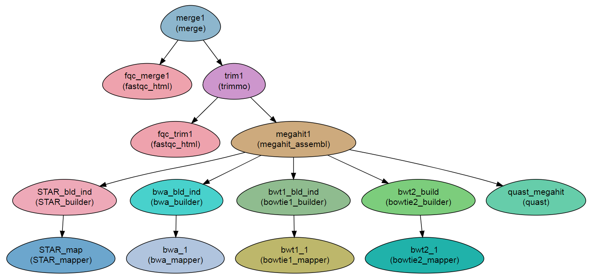

Assembly and Mapping 
---------------------

This workflow demonstrates the use of the index building and mapping modules.

It creates an assembly and maps the reads to it.

Steps:
~~~~~~~

1. Merging (``merge``), quality testing (``fastqc_html``) and trimming (``trimmo``).
2. A sample-wise assembly is constructed with ``megahit``.
3. Quality testing of the assembly with ``quast``.
4. An index for the assembly is created with ``bowtie2_builder``, ``bowtie_builder``, ``bwa_builder`` and ``STAR_builder`` modules.
5. The reads are mapped to the assembly with ``bowtie2_mapper``, ``bowtie_mapper``, ``bwa_mapper`` and ``STAR_mapper`` modules.

DAG
~~~

Requires
~~~~~~~~

``fastq`` files. Either paired end or Single end.

Programs required
~~~~~~~~~~~~~~~~~~

* `megahit      <https://github.com/voutcn/megahit>`_
* `quast        <http://bioinf.spbau.ru/quast>`_
* `FastQC       <https://www.bioinformatics.babraham.ac.uk/projects/fastqc/>`_
* `trimmomatic  <http://www.usadellab.org/cms/?page=trimmomatic>`_
* `bowtie2      <http://bowtie-bio.sourceforge.net/bowtie2/index.shtml>`_
* `bowtie       <http://bowtie-bio.sourceforge.net/index.shtml>`_
* `bwa          <http://bio-bwa.sourceforge.net/>`_
* `STAR         <https://github.com/alexdobin/STAR>`_

Example of Sample File
~~~~~~~~~~~~~~~~~~~~~~

::

    Title	Paired_end_project

    #SampleID	Type	Path    lane
    Sample1	Forward	/path/to/Sample1_F1.fastq.gz 1
    Sample1	Forward	/path/to/Sample1_F2.fastq.gz 2
    Sample1	Reverse	/path/to/Sample1_R1.fastq.gz 1
    Sample1	Reverse	/path/to/Sample1_R2.fastq.gz 2
    Sample2	Forward	/path/to/Sample2_F1.fastq.gz 1
    Sample2	Reverse	/path/to/Sample2_R1.fastq.gz 1
    Sample2	Forward	/path/to/Sample2_F2.fastq.gz 2
    Sample2	Reverse	/path/to/Sample2_R2.fastq.gz 2

Download
~~~~~~~~~

The workflow file is available :download:`here <../../../Workflows/Assembly_Indexing_mapping.yaml>`

