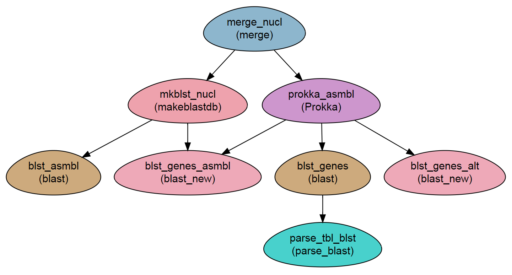

BLAST on `fasta` files
----------------------

This workflow shows various ways for using BLAST.

It begins with an assembly, `i.e.` a file in `fasta` format containing genomic sequences, and performs various BLAST searches on the file.
    
    

Steps:
~~~~~~~

1. Merging (``merge``)
2. Constructing a BLAST db from the assembly using the ``makeblastdb`` module
3. Searching the assembly using a `fasta` query file.
4. Annotation of the assemblies using ``Prokka``
5. Using the resulting predicted gene sequences to search a BLAST database (``blast`` and ``parse_blast`` modules).
6. Using the alternative BLAST module (``blast_new``) to search the **assembly** for the **predicted genes**.

Workflow Schema
~~~~~~~~~~~~~~~~

Requires
~~~~~~~~

Nucleotide `fasta` files. 

Programs required
~~~~~~~~~~~~~~~~~~

* `blast        <https://blast.ncbi.nlm.nih.gov/Blast.cgi?PAGE_TYPE=BlastDocs&DOC_TYPE=Download>`_
* `prokka       <http://www.vicbioinformatics.com/software.prokka.shtml>`_
* `parse_blast  <https://github.com/bioinfo-core-BGU/parse_blast>`_

Example of Sample File
~~~~~~~~~~~~~~~~~~~~~~

::

    Title       BlastExperiment

    #SampleID	Type	Path
    Sample1	Nucleotide	/path/to/Sample1_.fna
    Sample2	Nucleotide	/path/to/Sample2_.fna

    
Download
~~~~~~~~~

The workflow file is available :download:`here <../../../Workflows/BLAST_db.yaml>`

