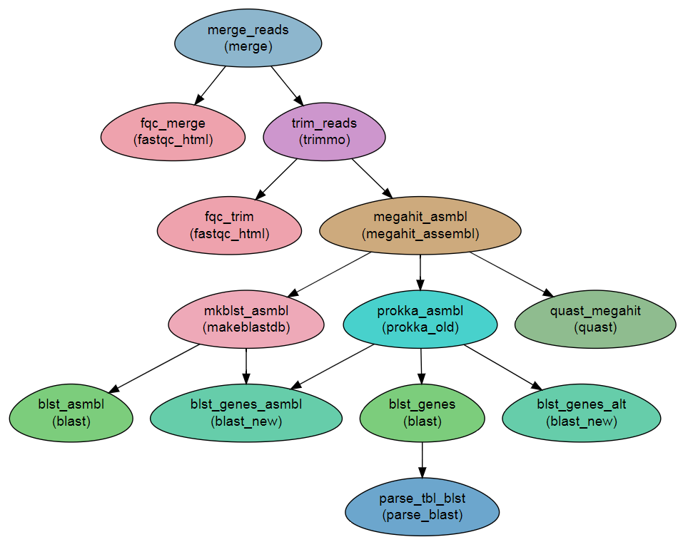

Assembly and Searching 
-----------------------

This workflow demonstrates various searching schemes with ``blast`` modules.

It begins with building an assembly from the reads, and then performs various operations on the assembly: (a) construction of a BLAST database from the assembly and searching the database with a `fasta` file supplied by the user; (b) annotation of the assembly and searching an external database with the predicted protein sequences and (c) searching for the predicted gene sequences in the assembly database.

Steps:
~~~~~~~

1. Merging and QC
2. Assembly using MEGAHIT (``megahit`` modules at sample scope. `i.e.` one assembly per sample)
3. Constructing a BLAST db from the assembly using the ``makeblastdb`` module
4. Searching the assembly using a `fasta` query file (``blast`` module).
5. Annotation of the assemblies using ``Prokka``.
6. Using the resulting predicted gene sequences to search a BLAST database.
7. Using the alternative BLAST module (``blast_new``) to search the assembly for the predicted genes.

DAG
~~~

Requires
~~~~~~~~

`fastqc` files. Either paired end or single end.

Programs required
~~~~~~~~~~~~~~~~~~

* `blast        <https://blast.ncbi.nlm.nih.gov/Blast.cgi?PAGE_TYPE=BlastDocs&DOC_TYPE=Download>`_
* `prokka       <http://www.vicbioinformatics.com/software.prokka.shtml>`_
* `megahit      <https://github.com/voutcn/megahit>`_
* `quast        <http://bioinf.spbau.ru/quast>`_
* `FastQC       <https://www.bioinformatics.babraham.ac.uk/projects/fastqc/>`_
* `trimmomatic  <http://www.usadellab.org/cms/?page=trimmomatic>`_
* `parse_blast  <https://github.com/bioinfo-core-BGU/parse_blast>`_

Example of Sample File
~~~~~~~~~~~~~~~~~~~~~~

::

    Title	Paired_end_project

    #SampleID	Type	Path    lane
    Sample1	Forward	/path/to/Sample1_F1.fastq.gz 1
    Sample1	Forward	/path/to/Sample1_F2.fastq.gz 2
    Sample1	Reverse	/path/to/Sample1_R1.fastq.gz 1
    Sample1	Reverse	/path/to/Sample1_R2.fastq.gz 2
    Sample2	Forward	/path/to/Sample2_F1.fastq.gz 1
    Sample2	Reverse	/path/to/Sample2_R1.fastq.gz 1
    Sample2	Forward	/path/to/Sample2_F2.fastq.gz 2
    Sample2	Reverse	/path/to/Sample2_R2.fastq.gz 2

    
Download
~~~~~~~~~

The workflow file is available :download:`here <../../../Workflows/BLAST_fasta.yaml>`

