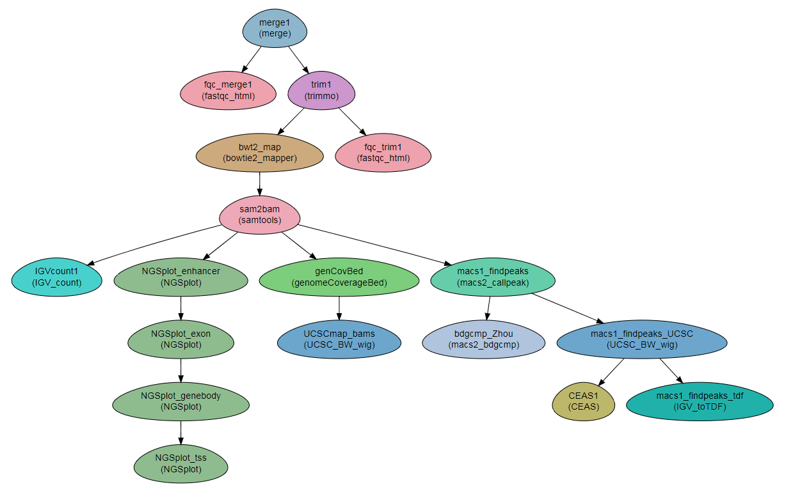

ChIP-seq workflow
---------------------

:Author: Menachem Sklarz
:Affiliation: Bioinformatics Core Facility
:Organization: National Institute of Biotechnology in the Negev, Ben Gurion University.

This workflow automates a standard ChIP-seq analysis.

.. Note:: This workflow is based on a workflow kindly provided by Dr. Dena Leshkowitz of the Life Sciences Core Facilities, Weizmann Institute of Science.

Steps:
~~~~~~~

1. Preparation and QA:
   a. Merging the reads into a single file per sample (``merge``).
   b. QC with fastqc (``fastqc_html``)
   c. Trimming with trimmomatic (``trimmo``)
   d. QC on trimmed reads with fastqc
2. Mapping 
   a. Mapping the reads to the reference genome with bowtie2 (``bowtie2_mapper``)
   b. Conversion to sorted BAM with samtools (``samtools``)
   c. Converting to UCSC and IGV format (``genomeCoverageBed``, ``UCSC_BW_wig`` and ``IGV_count``)
3. Finding ChIP peaks
   a. Peak calling is performed with macs2 callpeak (``macs2_callpeak``)
   b. Further analysis of the peaks is done with macs2 bdgcmp (``macs2_bdgcmp``)
4. Reporting
   a. Analysis of the BAM files is done with NGSplot, with -R set to `enhancer`, `exon`, `genebody` and `tss` (``NGSplot``)

Workflow Schema
~~~~~~~~~~~~~~~~

Requires
~~~~~~~~

* `fastq` files, either paired-end or single-end.
* A sample to control mapping (see Example sample lines below)

Programs required
~~~~~~~~~~~~~~~~~~

* `FastQC       <https://www.bioinformatics.babraham.ac.uk/projects/fastqc/>`_
* `trimmomatic  <http://www.usadellab.org/cms/?page=trimmomatic>`_
* `bowtie2      <http://bowtie-bio.sourceforge.net/bowtie2/index.shtml>`_
* `samtools     <http://www.htslib.org/>`_
* `MultiQC      <http://multiqc.info/>`_
* `macs2        <https://github.com/taoliu/MACS/wiki>`_
* `igvtools     <https://software.broadinstitute.org/software/igv/igvtools>`_
* `NGSplot      <https://github.com/shenlab-sinai/ngsplot>`_
* `bedtools     <http://bedtools.readthedocs.io/en/latest/>`_
* `kentUtils    <https://github.com/ENCODE-DCC/kentUtils>`_
* `CEAS         <http://liulab.dfci.harvard.edu/CEAS/>`_

Example of Sample File
~~~~~~~~~~~~~~~~~~~~~~

::

    Title	ChIP_project

    #SampleID	Type	Path    lane
    Sample1	Forward	/path/to/Sample1_F1.fastq.gz 1
    Sample1	Forward	/path/to/Sample1_F2.fastq.gz 2
    Sample1	Reverse	/path/to/Sample1_R1.fastq.gz 1
    Sample1	Reverse	/path/to/Sample1_R2.fastq.gz 2
    Sample2	Forward	/path/to/Sample2_F1.fastq.gz 1
    Sample2	Reverse	/path/to/Sample2_R1.fastq.gz 1
    Sample2	Forward	/path/to/Sample2_F2.fastq.gz 2
    Sample2	Reverse	/path/to/Sample2_R2.fastq.gz 2

    Sample_Control   Sample1:Sample2

Download
~~~~~~~~~

The workflow file is available :download:`here <../../../Workflows/ChIP_seq_bowtie2.yaml>`

