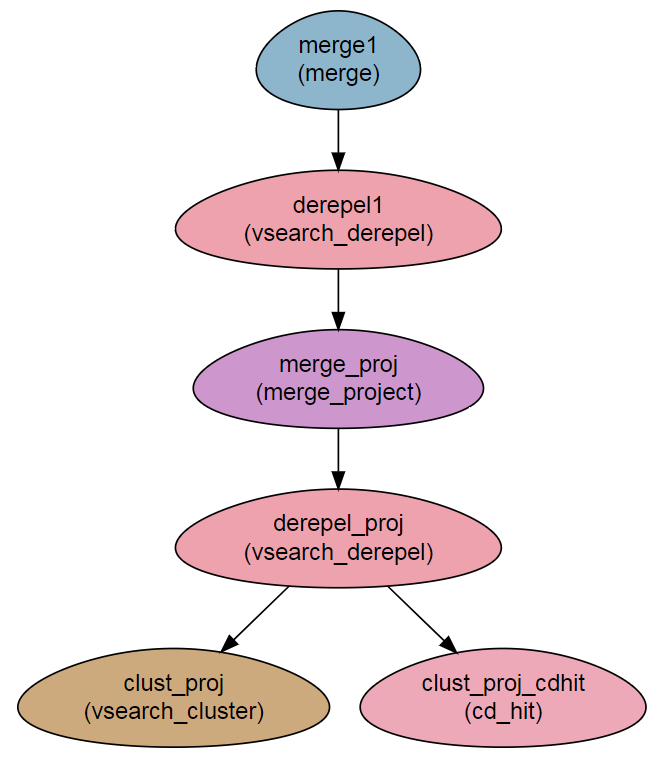

Read clustering 
---------------------

This workflow demonstrates methods to cluster reads with the ``vsearch`` module.

Steps:
~~~~~~~

1. `fastq` files are dereplicated with ``vsearch`` at the sample scope (``vsearch`` produces a **`fasta`** file),
2. resulting unique sequences are merged to obtain a project-level `fasta` file,
3. project level `fasta` file is again dereplicated and 
4. resulting sequences are clustered using ``vsearch`` and ``cd-hit`` (the user can choose between them)

Workflow Schema
~~~~~~~~~~~~~~~~

Requires
~~~~~~~~

* `fastq` files, either paired-end or single-end.

Programs required
~~~~~~~~~~~~~~~~~~

* `vsearch      <https://github.com/torognes/vsearch>`_
* `cd-hit       <http://weizhongli-lab.org/cd-hit/>`_

Example of Sample File
~~~~~~~~~~~~~~~~~~~~~~

::

    Title	ChIP_project

    #SampleID	Type	Path    lane
    Sample1	Forward	/path/to/Sample1_F1.fastq.gz 1
    Sample1	Forward	/path/to/Sample1_F2.fastq.gz 2
    Sample1	Reverse	/path/to/Sample1_R1.fastq.gz 1
    Sample1	Reverse	/path/to/Sample1_R2.fastq.gz 2
    Sample2	Forward	/path/to/Sample2_F1.fastq.gz 1
    Sample2	Reverse	/path/to/Sample2_R1.fastq.gz 1
    Sample2	Forward	/path/to/Sample2_F2.fastq.gz 2
    Sample2	Reverse	/path/to/Sample2_R2.fastq.gz 2

Download
~~~~~~~~~

The workflow file is available :download:`here <../../../Workflows/Clustering.yaml>`

