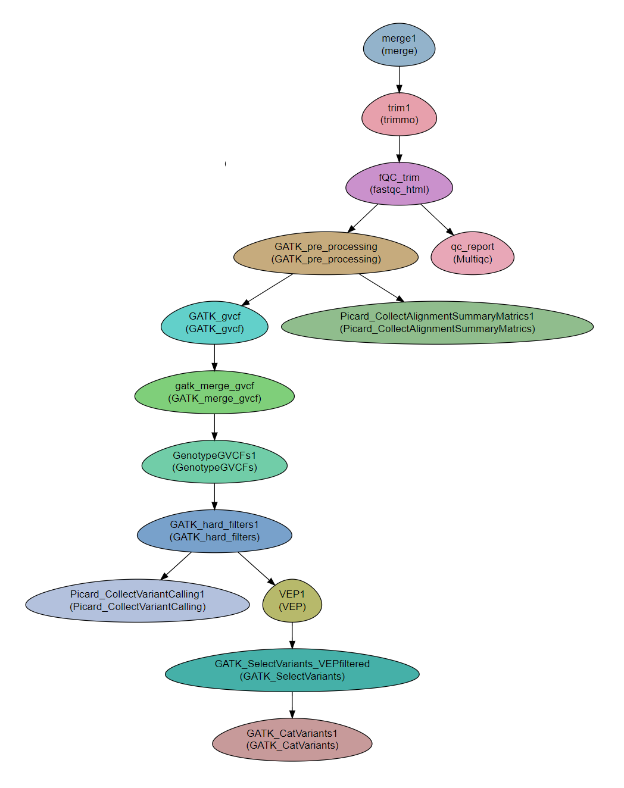

.. _gatk_var_analysis::

Variant analysis using GATK
---------------------------

A workflow for somatic short variant discovery (SNVs + Indels), based on `GATK Best Practices <https://software.broadinstitute.org/gatk/best-practices/workflow?id=11146>`_.
adapted for the analysis of rare diseases.

.. Note::

    * This workflow lacks the "base recalibration process (BQSR)" step.
    * In this workflow we use the option "hard filtering". The module for variant recalibration (VQSR) exists, and GATK recommends to use it with at least 30 exome samples.
    * Because some GATK modules work at the sample-chromosome level, the number of jobs is 24 times higher than the number of samples. Please make sure that the platform on which you work can handle such amount of jobs, in terms of memory management, CPU management, and the number of jobs that can wait in the queue.
It is recommended to carefully follow the log file and ensure that all jobs are completed successfully

:Authors: Michal Gordon
:Affiliation: Bioinformatics Core Facility
:Organization: National Institute of Biotechnology in the Negev, Ben Gurion University.
 
Steps:
~~~~~~~

1. Read preparation:
    1. merge
    2. trimmomatic - For cleaning the reads
    3. FastQC - Checking the quality of the reads
    4. MultiQC
2. Somatic short variant discovery analysis and annotation
    1. GATK pre-processing (from fastq to ready-to-use BAM : generate uBAM, MarkIlluminaAdapters, uBAM to fastq, BWA MEM, Merge BAM and UBAM, Mark Duplicates) - per sample.
    2. Picard_CollectAlignmentSummaryMatrics - statistical information about the mapping generated by CollectAlignmentSummaryMetrics from Picard tools.
    3. GATK_gvcf (HaplotypeCaller, from BAM to g.vcf ) - per sample per chromosome.
    4. GATK_merge_gvcf - CombineGVCFs combine g.vcf files to cohorts.
    5. GenotypeGVCFs - Perform joint genotyping on gVCF files produced by HaplotypeCaller, generate multi VCF file - per-cohort per-chromosome.
    6. GATK_hard_filters - Filter the multi VCF file - per cohort per chromosome.
    7. VEP - annotate the multi VCF file (`Variant Effect Predictor <https://www.ensembl.org/info/docs/tools/vep/index.html>`_. )
    8. Picard_CollectVariantCalling - statistical information about variants generated by CollectVariantCallingMetrics from Picard tools
    9. GATK_SelectVariants - Separate multi VCF per-chromosome to one VCF per-samples per-chromosomes.
    10. GATK_CatVariants - Concatenate chromosome to get one VCF file for each sample.

        
Workflow Schema
~~~~~~~~~~~~~~~~

Requires
~~~~~~~~

`fastq` files. Paired end or single-end.

Programs required
~~~~~~~~~~~~~~~~~~

* `FastQC       <https://www.bioinformatics.babraham.ac.uk/projects/fastqc/>`_
* `trimmomatic  <http://www.usadellab.org/cms/?page=trimmomatic>`_
* `GATK         <https://software.broadinstitute.org/gatk/>`_
* `VEP          <https://www.ensembl.org/info/docs/tools/vep/index.html>`_
* `Picard tools <https://broadinstitute.github.io/picard/>`_
* `BWA          <http://bio-bwa.sourceforge.net/>`_

Example of Sample File
~~~~~~~~~~~~~~~~~~~~~~

::

    Title	Metagenomics

    #SampleID	Type	Path    lane
    Sample1	Forward	/path/to/Sample1_F1.fastq.gz
    Sample1	Reverse	/path/to/Sample1_R1.fastq.gz
    Sample2	Forward	/path/to/Sample2_F1.fastq.gz
    Sample2	Reverse	/path/to/Sample2_R1.fastq.gz

Download
~~~~~~~~~

The workflow file is available :download:`here <../../../Workflows/GATK_workflow.yaml>`

