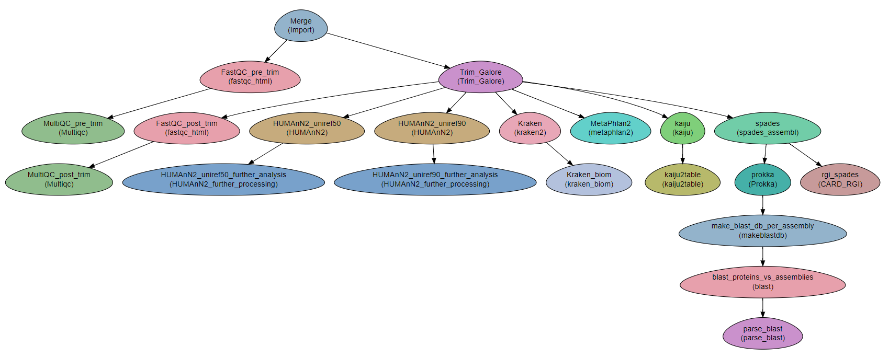

Metagenomics
---------------------

A workflow for executing various analyses on metagenomics data.

The workflow uses two approaches:

1. Analysis of the raw reads.
2. Assembly of the reads and analysis of the assembled contigs

**Developed as part of a study led by Prof. Jacob Moran-Gilad.**
 
Steps:
~~~~~~~

a. Analysis of the raw reads with:
    * ``kraken``
    * ``metaphlan2``
    * ``kaiju``
    * ``HUMAnN2``

    The output from the former three programs is also plotted with krona (to disable plotting with krona, comment out the lines referring to krona in the instance definition.)  
b. Assembly and analysis of the assembled reads:
    1. Assembly is done with two tools: ``spades`` and ``megahit``.
    2. Each assembly is quality tested with ``quast``.
    3. assemblies are annotated with ``Prokka``.
    4. Antibiotic resistance is determined with ``CARD_RGI``.
    5. **Not included**. Resistance and virulence can also be determined by BLASTing AR and virulence databases against the assemblies. See module BLAST.

DAG
~~~

Requires
~~~~~~~~

`fastq` files. Paired end or single-end.

Programs required
~~~~~~~~~~~~~~~~~~

* `FastQC       <https://www.bioinformatics.babraham.ac.uk/projects/fastqc/>`_
* `trimmomatic  <http://www.usadellab.org/cms/?page=trimmomatic>`_
* `kraken       <https://ccb.jhu.edu/software/kraken/>`_
* `kaiju        <http://kaiju.binf.ku.dk/>`_
* `metaphlan2   <https://bitbucket.org/biobakery/metaphlan2>`_
* `bowtie2      <http://bowtie-bio.sourceforge.net/bowtie2/index.shtml>`_
* `diamond      <https://ab.inf.uni-tuebingen.de/software/diamond>`_
* `HUMAnN2      <http://huttenhower.sph.harvard.edu/humann2>`_
* `megahit      <https://github.com/voutcn/megahit>`_
* `prokka       <http://www.vicbioinformatics.com/software.prokka.shtml>`_
* `quast        <http://bioinf.spbau.ru/quast>`_
* `spades       <http://bioinf.spbau.ru/spades>`_
* `RGI          <https://card.mcmaster.ca/analyze/rgi>`_
* `KronaTools   <https://github.com/marbl/Krona/wiki/KronaTools>`_

Example of Sample File
~~~~~~~~~~~~~~~~~~~~~~

::

    Title	Metagenomics

    #SampleID	Type	Path    lane
    Sample1	Forward	/path/to/Sample1_F1.fastq.gz 1
    Sample1	Forward	/path/to/Sample1_F2.fastq.gz 2
    Sample1	Reverse	/path/to/Sample1_R1.fastq.gz 1
    Sample1	Reverse	/path/to/Sample1_R2.fastq.gz 2
    Sample2	Forward	/path/to/Sample2_F1.fastq.gz 1
    Sample2	Reverse	/path/to/Sample2_R1.fastq.gz 1
    Sample2	Forward	/path/to/Sample2_F2.fastq.gz 2
    Sample2	Reverse	/path/to/Sample2_R2.fastq.gz 2

Download
~~~~~~~~~

The workflow file is available :download:`here <../../../Workflows/Metagenomics.yaml>`

