Microbe-Flow: a comprehensive workflow for bacterial genomics, pathogenomics and genomic epidemiology
-----------------------------------------------------------------------------------------------------
**A specialized workflow for bacterial genomics, pathogenomics and genomic epidemiology.**

:Author: Liron Levin
:Affiliation: Bioinformatics Core Facility
:Organization: National Institute of Biotechnology in the Negev, Ben Gurion University.

.. contents:: Table of Contents
    :local:
    :depth: 2
   
Short Description:
~~~~~~~~~~~~~~~~~~~
Microbe-Flow is an easy to setup, modular and flexible workflow for analyzing bacterial whole genome sequencing (WGS) data. It is based on the NeatSeq-Flow platform for modular workflow design and efficient execution on computer clusters. Microbe-Flow uses a wide range of tools to enable a comprehensive overview on large numbers  of samples. Microbe-Flow offers an automated solution for WGS, starting from FASTQ files, including raw reads quality control (QC), de novo assembly and its QC, gene prediction and annotation including virulence/resistance genes, phylogenetic analyses and typing based on variant calling and core SNPs, multilocus sequence typing (MLST) and core genome (cg)MLST. Notably, Microbe-Flow enables a range of studies including pan-genome and association analysis for desired bacterial attributes, bi-clustering of virulence genes including enrichment and gene cluster co-localization tests. Conveniently, Microbe-Flow is not species-specific and can be adjusted to any bacterium, while species-specific steps can be added as needed. It also produces a final report. Microbe-Flow was designed to work hand in hand with CONDA environments to enable an easy installation of almost all the pre-required programs and packages. Finally, Microbe-Flow is well documented and has step by step walk through instructions.

The Microbe-Flow Workflow performs the following tasks:
  * Quality testing and trimming of raw reads (paired or single end) using **Trim Galore** [1]_ and **Cutadapt** [2]_.
  * Contamination check using **Kraken** [3]_.
  * De novo assembly using **SPAdes** [4]_
  * De novo assembly QC using **QUAST** [5]_
  * Graphical QC reports (post and pre trimming) using **MultiQC** [6]_
  * Gene prediction and annotation including the identification of virulence genes from the `VFDB <http://www.mgc.ac.cn/VFs/>`_ database, using **Prokka** [7]_ and detection of resistance genes using **CARD RGI** [8]_.
  * Variant calling and generation of a core SNP set using  **Snippy** [9]_ and prediction of recombination regions by **Gubbins** [10]_
  * Multi-locus sequence typing (MLST) and core genome (cg) MLST using **GASSST** global alignment search tool [11]_ and in house scripts, including detection of new alleles.
  * Pan-genome analysis using **Roary** [12]_,including generation of a genes X genomes presence/absence matrix and association analysis based on the pan-genome using **scoary** [13]_.
  * Bi-clustering analysis of virulence genes, to identify groups of genes that are shared by subsets of the genomes using the **eisa** R package [14]_ and in-house scripts.. 
  * Enrichment analysis of gene groups and genome subsets, identified by the bi-clustering analysis using the  **clusterProfiler** R package [15]_ and in house scripts.
  * Co-localization analysis of gene clusters identified in the bi-clustering analysis using **Gecko3** [16]_.
  * Generation of output files ready to use in **phyloviz** [17]_.
  * Generation of multiple layers’ phylogenetic trees plots using **ggtree** R package [18]_ and in-house scripts. 
  * Generation of a final report that includes: Sample’s MetaData, reads QC, Kraken results, de novo assembly QC, pan-genome analysis matrix, resistance genes results and MLST typing

Advantages for using Microbe-Flow:
~~~~~~~~~~~~~~~~~~~~~~~~~~~~~~~~~~~~~
While using Microbe-flow the user has full control over the execution of the workflow. Moreover, the workflow is not a ‘black box’. It is transparent, and all the underlying commands are available to the user. The workflow can be efficiently executed on computer clusters by parallelizing on both samples and workflow steps. The workflow is highly reproducible and the same analysis can be repeated at any time in the future. The user is relieved from the need to know or manage the location of the workflow’s intermediate or final files. Nevertheless, the results of all workflow steps are neatly organized in designated folders for easy navigation. The workflow is flexible and steps can be easily added or removed. The user can monitor the progress of the workflow and observe execution(s) errors in real time.

.. note:: **Microbe-Flow** was developed as part of a study led by Prof. Jacob Moran-Gilad.

.. tip:: This Workflow has lots of dependencies [Programs and R/Python Packages] therefore it is **highly recommended** to use CONDA for instant installation of the entire environment. **See The** :ref:`Using CONDA environment` **section**.  

A schematic description of **Microbe-flow**
++++++++++++++++++++++++++++++++++++++++++++++++++

Requirements
++++++++++++++++

Files required
******************

    * | A samples file indicating the locations of the sample’s **fastq** file(s) (paired or single).
      |   See example in :ref:`Samples file<Example Sample file>`
    * | A reference genome [FASTA/GeneBank formats] for **Snippy**
    * | A Kraken database for **Kraken**
    * | A samples Meta-Data file. 
      |   See example in :ref:`Sample’s Meta-Data file<Example Sample’s Meta-Data file>`
    
    **For the MLST/cgMLST Typing:**
    
    * | A **FASTA** file of the allele sequences.
      |  See example in :ref:`Typing FASTA File<Example FASTA file>`
    * | A Tab-delimited file of the typing **scheme**.
      |  See example in :ref:`Typing Scheme File<Example scheme file>`
    * | A Tab-delimited file that connects: allele name from the FASTA file to gene and allele number.
      |  See example in :ref:`Typing Alleles Map File<Example Typing Alleles Map file>`

    .. tip:: | You can use a shell script to download the **Typing Required Files** from `PubMLST  <https://pubmlst.org/>`_ [19]_  
             | **See** :ref:`Get Scheme<Get Scheme>`

.. _Programs required:
             
Programs required
*******************

  * ``fastqc`` *
  * ``Trim-Galore`` *
  * ``cutadapt`` *
  * ``Kraken`` *
  * ``Snippy`` *
  * ``Spades`` *
  * ``Quast`` *
  * ``rgi`` *
  * ``Prokka`` *
  * ``Roary`` *
  * ``multiqc`` *
  * ``scoary`` *
  * ``Gubbins`` *
  * ``Gassst`` (`Download Gassst <https://www.irisa.fr/symbiose/projects/gassst/>`_)
  * ``Gecko3`` (`Download Gecko3 <https://bio.informatik.uni-jena.de/software/gecko3/>`_)

.. _Packages required:

Packages required
*********************

**Python2.7:**
    * ``pyyaml`` *
    * ``pandas`` *
    * ``bunch`` *
    * ``patsy`` *
    * ``seaborn`` *
    * ``matplotlib`` *
    * ``numpy`` *
    * ``scipy`` *
    * ``openpyxl`` *
**R:**
    * ``htmlwidgets`` *
    * ``diagrammer`` *
    * ``XML`` *
    * ``magrittr`` *
    * ``plyr`` *
    * ``optparse`` *
    * ``openxlsx`` *
    * ``dplyr`` *
    * ``ape`` *
    * ``ggtree`` [bioconductor] *
    * ``clusterprofiler`` [bioconductor] *
    * ``hgu95av2.db`` [bioconductor] **
    * ``ExpressionView`` [bioconductor] **
    * ``eisa`` [bioconductor] **

.. attention:: These Programs/Packages are the main Programs/Packages used in this Workflow However, **they might have their own dependencies** 
.. note:: 
    * The Programs/Packages marked by * will be installed automatically **[with all their dependencies]** when using CONDA environment. 
    * The R packages marked by ** are not available through CONDA, however, when using CONDA environment they will be installed to the CONDA environment on the first run of the relevant R scripts.
    * The **Gubbins** program needs a different version of python **(v3.6)** therefore needs to run in different CONDA environment.
    
    **See The** :ref:`Using CONDA environment` **section**
    
Requirements Table
************************
    
.. csv-table:: 
    :header: "Step", "Module" ,"Programs", "Python packages", "R packages"
    :widths: 15, 10, 10, 10, 10

    "Merge", "Merge", "", "pyyaml, bunch", ""
    "FastQC_Merge", "fastqc_html", "fastqc", "", ""
    "Trim_Galore", "Trim_Galore", "Trim-Galore, cutadapt", "", ""
    "FastQC_Trim_Galore", "fastqc_html", "fastqc", "", ""
    "Kraken", "kraken", "Kraken", "", ""
    "Collect_kraken", "Collect_results", "", "pandas, openpyxl", ""
    "Snippy", "Snippy", "Snippy", "pandas", ""
    "Gubbins", "Gubbins", "Gubbins", "python3.6,pandas", ""
    "Spades", "spades_assembl", "Spades", "", ""
    "Quast", "quast", "Quast", "", ""
    "Prokka", "Prokka", "Prokka", "", ""
    "CARD_RGI", "CARD_RGI", "rgi", "", ""
    "Collect_CARD_RGI", "Collect_results", "", "pandas, openpyxl", ""
    "Roary", "Roary", "Roary, scoary [optional], Gecko3 [optional]", "pandas, patsy, seaborn, matplotlib, numpy, scipy", "optparse, eisa, ExpressionView, openxlsx, clusterProfiler, org.Hs.eg.db"
    "Collect_Roary", "Collect_results", "", "pandas, openpyxl", ""
    "Collect_Virulence", "Collect_results", "", "pandas, openpyxl", ""
    "MLST_Gassst", "Gassst", "Gassst", "pandas", ""
    "MLST_parse_blast", "parse_blast", "parse_blast.R [From NeatSeq-Flow]", "", "magrittr, plyr, optparse"
    "MLST_verdict", "cgMLST_and_MLST_typing", "", "pandas", "magrittr, plyr, optparse"
    "cgMLST_Gassst", "Gassst", "Gassst", "pandas", ""
    "cgMLST_parse_blast", "parse_blast", "parse_blast.R [From NeatSeq-Flow]", "", "magrittr, plyr, optparse"
    "cgMLST_verdict", "cgMLST_and_MLST_typing", "", "pandas", "magrittr, plyr, optparse"
    "Collect_typing_verdict", "Collect_results", "", "pandas, openpyxl", ""
    "MultiQC_raw_reads", "Multiqc", "multiqc", "", ""
    "MultiQC_post_trim", "Multiqc", "multiqc", "", ""
    "Collect_MultiQC_post_trim", "Collect_results", "", "pandas, openpyxl", ""
    "Collect_MultiQC_raw_reads", "Collect_results", "", "pandas, openpyxl", ""
    "Collect_ALL", "Collect_results", "", "pandas, openpyxl", ""
    "Plot_Trees_Resistance", "Tree_plot", "", "", "ggtree, optparse, openxlsx, ape"
    "Plot_Trees_virulence", "Tree_plot", "", "", "ggtree, optparse, openxlsx, ape"

Examples of Required Files
*******************************

.. _Example Sample file:

Samples File [Tab delimited]
##############################################

::

  Title       Microbe-Flow

  #SampleID	Type			Path
  Sample1	Forward		Sample1F.fastq
  Sample1	Reverse		Sample1R.fastq
  Sample2	Forward		Sample2F.fastq
  Sample2	Reverse		Sample2R.fastq
  Sample3	Forward		Sample3F.fastq
  Sample3	Reverse		Sample3R.fastq

.. _Example Sample’s Meta-Data file:

Sample’s Meta-Data file [Tab delimited]
##############################################

::

    Samples	SourceType	GeographicLocation
    Sample1	Nose		USA
    Sample2	Nose		CANADA
    Sample3	Blood		UK

.. _Example FASTA file:    

MLST/cgMLST Typing FASTA File
##############################################

::

    >arcC_1
    TTATTAATCCAACAAGCTAAATCGAACAGTGACACAACGCCGGCAATGCCATTGGATACT
    TGTGGTGCAATGTCACAGGGTATGATAGGCTATTGGTTGGAAACTGAAATCAATCGCATT
    >arcC_2
    TTATTAATCCAACAAGCTAAATCGAACAGTGACACAACGCCGGCAATGCCATTGGATACT
    TGTGGTGCAATGTCACAAGGTATGATAGGCTATTGGTTGGAAACTGAAATCAATCGCATT
    TTAACTGAAATGAATAGTGATAGAACTGTAGGCACAATCGTAACACGTGTGGAAGTAGAT
    >arcC_3
    TTATTAATCCAACAAGCTAAATCGAACAGTGACACAACGCCGGCAATGCCATTGGATACT
    TGTGGTGCAATGTCACAGGGTATGATAGGCTATTGGTTGGAAACTGAAATCAATCGCATT

    
.. _Example Typing Alleles Map file:  

MLST/cgMLST Typing Alleles Map File [Tab delimited]
#########################################################

::

    Allele	Gene	Number
    arcC_1	arcC	1
    arcC_2	arcC	2
    arcC_3	arcC	3

.. _Example scheme file:  

MLST/cgMLST Typing Scheme File [Tab delimited]
################################################

::

    ST      arcC    aroE    glpF    gmk     pta     tpi     yqiL
    1       1       1       1       1       1       1       1
    2       2       2       2       2       2       2       26
    3       1       1       1       9       1       1       12
    4       10      10      8       6       10      3       2
    5       1       4       1       4       12      1       10

.. _Get Scheme:

.. tip:: You can use a :download:`shell script <../../../Workflows/Microbe-Flow/get_scheme.sh>`  to download the **Typing Required Files** from `PubMLST  <https://pubmlst.org/>`_

        In the command line type:

          .. code-block:: csh
          
             curl -LO https://raw.githubusercontent.com/bioinfo-core-BGU/neatseq-flow-modules/master/Workflows/Microbe-Flow/get_scheme.sh

        **For example:** in order to download the **MLST** Required Files of **Campylobacter jejuni**  
        
        In the command line type:

          .. code-block:: csh     
          
             sh get_scheme.sh "Campylobacter jejuni" "MLST" 
             
     **Go to** `PubMLST  <https://pubmlst.org/>`_ **to make sure the correct scheme was downloaded!!!!**
     
Install and Run Microbe-Flow
~~~~~~~~~~~~~~~~~~~~~~~~~~~~~~~~~~
    **There are two ways to install and run the Microbe-Flow workflow:**
        * For users that needs to install all/most of the required :ref:`programs<Programs required>`/:ref:`packages<Packages required>` it is recommended to :ref:`Install using CONDA<Using CONDA environment>`
        * Users that already have the required :ref:`programs<Programs required>`/:ref:`packages<Packages required>` installed on their system can :ref:`use a local copy of NeatSeq-Flow<Using a local copy of NeatSeq-Flow>`
        
    **To perform a test run on a publicly available data jump to the** :ref:`Perform a test run <Perform a test run start>` **section**
    
.. _Using CONDA environment:

Using CONDA environment
++++++++++++++++++++++++++++++++
  The easiest way to run Microbe-Flow is through CONDA virtual environment.
  For that you will need:

  * Conda installed on your system (very easy installation of `miniconda  <https://conda.io/miniconda.html>`_).
  * :download:`The Microbe-Flow CONDA installer file <../../../Workflows/Microbe-Flow/Microbe-Flow_conda_env_install.yaml>` [including NeatSeq-Flow]
  * :download:`The Gubbins CONDA installer file<../../../Workflows/Microbe-Flow/Microbe-Flow_GUBBINS_conda_env_install.yaml>`
  * :download:`The Microbe-Flow parameter file <../../../Workflows/Microbe-Flow/Microbe-Flow_conda.yaml>` 
  
1. Create NeatSeq-Flow project directory
********************************************
  In the command line type:

  .. code-block:: csh

     mkdir Microbe-Flow 
     cd Microbe-Flow 

2. Install the Microbe-Flow environment 
*********************************************************************
**This installation includes NeatSeq-Flow, it's modules and most of the required programs and packages**

  .. note:: Some R packages are not available through CONDA, however, they will be installed to the CONDA environment on the first run of the relevant R scripts
    
  .. attention:: **This installation will take a while [several hours]!!**

  In the command line type:

  .. code-block:: csh
  
     conda config --add channels conda-forge
     conda config --add channels bioconda
     curl -LO https://raw.githubusercontent.com/bioinfo-core-BGU/neatseq-flow-modules/master/docs/source/_extra/Microbe-Flow/Microbe-Flow_conda_env_install.yaml

     conda env create -f  Microbe-Flow_conda_env_install.yaml
     curl -LO https://raw.githubusercontent.com/bioinfo-core-BGU/neatseq-flow-modules/master/docs/source/_extra/Microbe-Flow/Microbe-Flow_GUBBINS_conda_env_install.yaml
     conda env create -f  Microbe-Flow_GUBBINS_conda_env_install.yaml

3. Activate the Microbe-Flow environment
******************************************************************************************

  .. attention:: **From the following step onwards, you should be in ``bash`` shell**
      
      In the command line type:

      .. code-block:: csh

        bash

  In the command line type:

  .. code-block:: csh

    source activate Microbe-Flow
    export CONDA_BASE=$(conda info --root)

  .. note:: To perform a test run on a publicly available data jump to the :ref:`Perform a test run <Perform a test run>` section
  
  
4. Create a Samples file for your project
**********************************************

  In the command line type:

  .. code-block:: csh
    
    nano Samples.nsfs

  .. note::  Define your samples and their file locations and **Don't forget to save the file when you’re done!**
  .. tip::   You can do the editing with any text editor of your liking (e.g. Notepad++, not Microsoft Word). However:
  
        * The file needs to be in unix End Of Line (EOL) format. 
        * Don't forget to copy it to the project directory.
     

5. Edit the Microbe-Flow parameter file to suit your cluster
***************************************************************

  In the command line type:

  .. code-block:: csh
    
    curl -LO https://raw.githubusercontent.com/bioinfo-core-BGU/neatseq-flow-modules/master/Workflows/Microbe-Flow/Microbe-Flow_conda.yaml
    nano  Microbe-Flow_conda.yaml

  .. tip:: You can do the editting with any text editor of your liking. However:
  
        * The file needs to be in unix End Of Line (EOL) format. 
        * Don't forget to copy it to the project directory.

  .. attention:: Edit the global params section [Especially the lines marked by **<<**]:

      .. code-block:: yaml

        Global_params:
            Qsub_opts: -cwd
            Qsub_path: /PATH_TO_YOUR_QSUB/ <<
            Qsub_q: your.q <<
            Default_wait: 10
  
  .. tip:: The ``Qsub_path`` parameter can be determined by executing the following command:
  
    .. code-block:: csh
    
        dirname `which qsub`
    
    and replacing /PATH_TO_YOUR_QSUB/ with the result.

  .. attention:: Edit the Vars section [Especially the lines marked by **<<**]:

      .. code-block:: yaml

        Vars:
            # For running using conda environments:
            conda:
                base: # Can be empty if running from conda environment 
                env: Microbe-Flow
            # Set your Parallel Environment :
            Parallel_Environment:
                # Run 'qconf -spl' to view all the Parallel Environments [pe_name] available to you
                pe_name: << 
                # Set for each program the number/range of slots[cpus] to request per sample/project
                FastQC: '1' << 
                Snippy: '1' << 
                Spades: '1' << 
                Kraken: '1' << 
                Quast: '1' << 
                CARD_RGI: '1' << 
                Prokka: '1' << 
                Roary: '1' << 
                Gassst: '1' << 
            # If conda environment is not used, give the full path to the following programs:
            Programs_path:
                Trim_Galore:
                    Main: trim_galore
                    cutadapt: cutadapt
                FastQC: fastqc
                Kraken: kraken
                Snippy:
                    Main: snippy
                    snippy_core: snippy-core
                Gubbins: 
                    # If you choose NOT to run gubbins write in the next line: script_path: ''
                    script_path: run_gubbins.py 
                    conda:
                        base: # Can be empty if running from conda environment 
                        # If you choose NOT to run gubbins write in the next line: env: Microbe-Flow
                        env:  gubbins 
                Spades: spades.py
                Quast: quast
                CARD_RGI:
                    Main: rgi
                    JSON2tsv_script: rgi_jsontab
                Prokka: prokka
                Roary: 
                    Main: roary
                    scoary: scoary
                    Gecko3: /PATH_TO_GECKO3/ <<
                Gassst: /PATH_TO_GASSST/ << 
                parse_blast: parse_blast.R
                Multiqc: multiqc
            Genome:
                reference: /PATH_TO_REFERENCE_GENOME_IN_FASTA_or_GENBANK_FORMAT/ <<
                genus: '"YOUR_GENUS"' <<
                kingdom: '"Bacteria"' <<
            MetaData:
                File: /PATH_TO_YOUR_METADATA_FILE/ <<
                # THE COLUMN NAME IN THE METADATA FILE OF THE SAMPLES IDs
                Sample_ID_column_name: Samples << 
            Typing:
                MLST:
                    FASTA: /PATH_TO_YOUR_MLST_FASTA_FILE/ <<
                    scheme: /PATH_TO_YOUR_MLST_SCHEME_FILE/ <<
                    Allele: /PATH_TO_YOUR_MLST_ALLELE_MAP_FILE/ <<
                    # EDIT/ADD COLUMN IN THE SCHEME FILE THAT ARE NOT LOCUS NAMES (COMMA DELIMITED)
                    Type_col_name: "ST,clonal_complex" << 
                cgMLST:
                    FASTA: /PATH_TO_YOUR_cgMLST_FASTA_FILE/ <<
                    scheme: /PATH_TO_YOUR_cgMLST_SCHEME_FILE/ <<
                    Allele: /PATH_TO_YOUR_cgMLST_ALLELE_MAP_FILE/ <<
                    # EDIT/ADD COLUMN IN THE SCHEME FILE THAT ARE NOT LOCUS NAMES (COMMA DELIMITED)
                    Type_col_name: "cgST" << 
            Database:
                kraken: /PATH_TO_KRAKEN_DATA_BASE/ <<
            Additional:
                Roary:
                    Bi_cluster:
                        # EDIT/ADD COLUMN IN THE META DATA FILE TO BE ADDED TO THE BI-CLUSTERING RESULTS
                        cols_to_use: '"SourceType","GeographicLocation"' << 
                    scoary:
                        # a list of conditions to create the scoary traits file from MetaData file.
                        # Pairs of field and operator + value to convert to boolean traits: field_name1/op_value1 
                        # Example: "field_1/>=val_1<val_2"    "feild_2/=='str_val'"
                        # A Filter can be used by FILTER_field_name1/FILTER_op_value1&field_name1/op_value1
                        traits_to_pars: '"SourceType/==''Nose''" "SourceType/==''Blood''"' <<   

  .. note:: You need to specify a **Parallel Environment Name [pe_name] !!!**
      
      You can type in the command line:
      
      .. code-block:: csh

        qconf -spl
        
      To view all PEs [pe_name] available to you.

  .. tip:: If you don't have a Kraken database you can create one using this command:
     
     .. code-block:: csh

        mkdir Kraken_db
        kraken-build  --standard --db Kraken_db
     
     Then edit the following line:
        kraken: /PATH_TO_KRAKEN_DATA_BASE/
     To say:
        kraken: Kraken_db
    
  .. tip:: You can skip a workflow step by adding a ``SKIP:`` line at the step definition in the parameter file.
        
        For example to skip the kraken step:
        
        .. code-block:: yaml
        
            Kraken:
                SKIP: 
                module: kraken
                base: Trim_Galore
                script_path: {Vars.Programs_path.Kraken}
                qsub_params:
                    -pe: '{Vars.Parallel_Environment.pe_name} {Vars.Parallel_Environment.Kraken}'
                redirects:
                    --db: {Vars.Database.kraken}
                    --preload: null
                    --quick: null
                    --threads: {Vars.Parallel_Environment.Kraken}

  
  .. note::  **Don't forget to save the file when you’re done!**

     

6. Run NeatSeq-Flow
********************

  In the command line type:

  .. code-block:: csh

    neatseq_flow.py                                                      \
    --sample_file Samples.nsfs                                           \
    --param_file  Microbe-Flow_conda.yaml  \
    --message     "an informative message"

  .. note::  If NeatSeq-Flow says :``Finished successfully....`` it is OK to move on.

7. Run Microbe-Flow
**********************

  In the command line type:

  .. code-block:: csh

    csh scripts/00.workflow.commands.csh

.. _NeatSeq-Flow monitor:

8. Run the NeatSeq-Flow monitor
*********************************

  In the command line type:

  .. code-block:: csh

    neatseq_flow_monitor.py

.. note:: If you executed NeatSeq-Flow several times before running the workflow, you will have to select the correct log file in the upper window of the monitor. The log file is identified by the run code, which is composed of the date and time of NeatSeq-Flow execution.
.. tip:: The NeatSeq-Flow monitor is color-coded and for each step or sample:

    * | **Green:** indicate that **No problems were detected**.
    * | **Red:** indicate that **Problems were detected** 
      |     [Step/sample finished with Errors or did not finished at all]
    * | **Yellow:** indicate that **The step/sample is in progress**

9. Checking the Workflow output
************************************

    * Browse the ``data/`` directory for the outputs from the programs executed by Microbe-Flow.
    * You can also check out the log files, the standard output and error files in the ``logs/``, ``stdout/`` and ``stderr/`` directories, respectively. **It is especially informative when problems were identified in the** :ref:`The NeatSeq-Flow monitor<NeatSeq-Flow monitor>` 

10. Deactivate Microbe-Flow environment
******************************************************************************************

    Deactivate the Microbe-Flow environment if you want to go back to you're regular system settings.
    
    .. note:: Deactivation of the Microbe-Flow environment **will not delete** the environment [and its programs] it will only be **inaccessible** until the next time you activate it. In order to Un-install the environment [and delete all programs] **See** :ref:`Un-install the environment<Un-install the environment>` 
    
  In the command line type:

  .. code-block:: csh

    source deactivate 

.. _Un-install the environment:

11. Un-install the Microbe-Flow environment
******************************************************************************************
    
  .. warning:: Since installing Microbe-Flow environment takes time, un-install it only if you are not going to use it in the future.

  .. code-block:: csh

    conda remove --name  Microbe-Flow --all
    conda remove --name  gubbins --all

.. _Using a local copy of NeatSeq-Flow:

Using a local copy of NeatSeq-Flow
++++++++++++++++++++++++++++++++++++++++++++++++++++++++++++++++
  
  If you have all the required programs installed on your system you can download and run NeatSeq-Flow without installation.

  **For that you will need:**

  * Python 2.7 installed
  * The python dependencies: yaml and bunch (you can install them by using ``pip install yaml bunch`` in the command line).
  * All the required programs for this workflow installed on your system.
  * :download:`Microbe-Flow parameter file <../../../Workflows/Microbe-Flow/Microbe-Flow.yaml>` 
  
.. attention:: The Programs/Packages used in Microbe-Flow might have their own dependencies **Make sure they are all satisfied** 

1. Create NeatSeq-Flow project directory
******************************************************************************************
  In the command line type:

  .. code-block:: csh

     mkdir Microbe-Flow
     cd Microbe-Flow 
  
  
2. Download the NeatSeq-Flow repositories from github
******************************************************************************************
  In the command line type:

  .. code-block:: csh

    mkdir NeatSeq-Flow
    cd NeatSeq-Flow 
    git clone https://github.com/bioinfo-core-BGU/neatseq-flow.git
    git clone https://github.com/bioinfo-core-BGU/neatseq-flow-modules.git
    git clone https://github.com/bioinfo-core-BGU/parse_blast.git
    cd ..

3. Create a Samples file for your project
******************************************************************************************

  In the command line type:

  .. code-block:: csh
    
    nano Samples.nsfs

  .. note::  Define your samples and their file locations and **Don't forget to save the file when you’re done!**
  .. tip::  You can do the editing with any text editor of your liking. However:
  
        * The file needs to be in unix End Of Line (EOL) format. 
        * Don't forget to copy it to the project directory.
     

4. Edit the Microbe-Flow parameter file to suit your cluster
******************************************************************************************

  In the command line type:

  .. code-block:: csh
    
    curl -LO https://raw.githubusercontent.com/bioinfo-core-BGU/neatseq-flow-modules/master/Workflows/Microbe-Flow/Microbe-Flow.yaml

    nano  Microbe-Flow.yaml

  .. attention:: Edit the global params section [Especially the lines marked by **<<**]:

      .. code-block:: yaml

        Global_params:
            Qsub_opts: -cwd
            Qsub_path: /PATH_TO_YOUR_QSUB/ <<
            Qsub_q: your.q <<
            Default_wait: 10
            module_path: /PATH_TO_NEATSEQ-FLOW_MODULES/ <<
      
  .. tip:: The ``Qsub_path`` parameter can be determined by executing the following command:
  
    .. code-block:: csh
    
        dirname `which qsub`
    
    and replacing /PATH_TO_YOUR_QSUB/ with the result.
    
  .. tip:: The ``module_path`` parameter can be determined by executing the following command:
  
    .. code-block:: csh
    
        echo $cwd/NeatSeq-Flow/neatseq-flow-modules/neatseq_flow_modules/
    
    and replacing /PATH_TO_NEATSEQ-FLOW_MODULES/ with the result.
    

  .. attention:: Edit the Vars section [Especially the lines marked by **<<**]:

      .. code-block:: yaml

        Vars:
            # Set your Parallel Environment :
            Parallel_Environment:
                # Run 'qconf –spl' to view all the Parallel Environments [pe_name] available to you
                pe_name: << 
                # Set for each program the number/range of slots[cpus] to request per sample/project
                FastQC: '1' << 
                Snippy: '1' << 
                Spades: '1' << 
                Kraken: '1' << 
                Quast: '1' << 
                CARD_RGI: '1' << 
                Prokka: '1' << 
                Roary: '1' << 
                Gassst: '1' << 
            # If conda environment is not used, give the full path to the following programs:
            Programs_path:
                Trim_Galore:
                    Main: /PATH_TO/trim_galore <<
                    cutadapt: /PATH_TO/cutadapt <<
                FastQC: /PATH_TO/fastqc <<
                Kraken: /PATH_TO/kraken <<
                Snippy:
                    Main: /PATH_TO/snippy <<
                    snippy_core: /PATH_TO/snippy-core <<
                Gubbins: 
                    # If you choose NOT to run gubbins write in the next line: script_path: ''
                    script_path: python /PATH_TO/run_gubbins.py <<
                Spades: python /PATH_TO/spades.py <<
                Quast: /PATH_TO/quast <<
                CARD_RGI:
                    Main: /PATH_TO/rgi <<
                    JSON2tsv_script: /PATH_TO/rgi_jsontab <<
                Prokka: /PATH_TO/prokka <<
                Roary: 
                    Main: /PATH_TO/roary <<
                    scoary: /PATH_TO/scoary <<
                    Gecko3: /PATH_TO_GECKO3/ <<
                Gassst: /PATH_TO_GASSST/ << 
                parse_blast: /PATH_TO/parse_blast.R <<
                Multiqc: /PATH_TO/multiqc <<
            Genome:
                reference: /PATH_TO_REFERENCE_GENOME_IN_GENEBANK_FORMAT/ <<
                genus: '"YOUR_GENUS"' <<
                kingdom: '"Bacteria"' <<
            MetaData:
                File: /PATH_TO_YOUR_METADATA_FILE/ <<
                # THE COLUMN NAME IN THE METADATA FILE OF THE SAMPLES IDs
                Sample_ID_column_name: Samples << 
            Typing:
                MLST:
                    FASTA: /PATH_TO_YOUR_MLST_FASTA_FILE/ <<
                    scheme: /PATH_TO_YOUR_MLST_SCHEME_FILE/ <<
                    Allele: /PATH_TO_YOUR_MLST_ALLELE_MAP_FILE/ <<
                    # EDIT/ADD COLUMN IN THE SCHEME FILE THAT ARE NOT LOCUS NAMES (COMMA DELIMITED)
                    Type_col_name: "ST"<< 
                cgMLST:
                    FASTA: /PATH_TO_YOUR_cgMLST_FASTA_FILE/ <<
                    scheme: /PATH_TO_YOUR_cgMLST_SCHEME_FILE/ <<
                    Allele: /PATH_TO_YOUR_cgMLST_ALLELE_MAP_FILE/ <<
                    # EDIT/ADD COLUMN IN THE SCHEME FILE THAT ARE NOT LOCUS NAMES (COMMA DELIMITED)
                    Type_col_name: "cgST" << 
            Database:
                kraken: /PATH_TO_KRAKEN_DATA_BASE/ <<
            Additional:
                Roary:
                    Bi_cluster:
                        # EDIT/ADD COLUMN IN THE META DATA FILE TO BE ADDED TO THE BI-CLUSTERING RESULTS
                        cols_to_use: '"SourceType","GeographicLocation"' << 
                    scoary:
                        # a list of conditions to create the scoary traits file from MetaData file.
                        # Pairs of field and operator + value to convert to boolean traits: field_name1/op_value1 
                        # Example: "field_1/>=val_1<val_2"    "feild_2/=='str_val'"
                        # A Filter can be used by FILTER_field_name1/FILTER_op_value1&field_name1/op_value1
                        traits_to_pars: '"SourceType/==''Nose''" "SourceType/==''Blood''"' <<   

  .. note:: You need to specify a **Parallel Environment Name [pe_name] !!!**
      
      You can type in the command line:
      
      .. code-block:: csh

        qconf –spl
        
      To view all PEs [pe_name] available to you.

  .. tip:: The ``parse_blast`` parameter can be determined by executing the following command:
  
    .. code-block:: csh
    
        echo $cwd/NeatSeq-Flow/parse_blast/bin/parse_blast.R
    
    and replacing /PATH_TO/parse_blast.R with the result.
    
  .. tip:: You can skip a workflow step by adding a ``SKIP:`` line at the step definition in the parameter file.
    
    For example to skip the kraken step:
    
    .. code-block:: yaml
    
        Kraken:
            SKIP: 
            module: kraken
            base: Trim_Galore
            script_path: {Vars.Programs_path.Kraken}
            qsub_params:
                -pe: '{Vars.Parallel_Environment.pe_name} {Vars.Parallel_Environment.Kraken}'
            redirects:
                --db: {Vars.Database.kraken}
                --preload: null
                --quick: null
                --threads: {Vars.Parallel_Environment.Kraken}

  .. note::  **Don't forget to save the file when you’re done!**
  .. tip:: You can do the editting with any text editor of your liking. However:
  
        * The file needs to be in unix End Of Line (EOL) format. 
        * Don't forget to copy it to the project directory.
     
  

5. Run NeatSeq-Flow
******************************************************************************************

  In the command line type:

  .. code-block:: csh

    python NeatSeq-Flow/neatseq-flow/bin/neatseq_flow.py                                                      \
    --sample_file Samples.nsfs                                           \
    --param_file  Microbe-Flow.yaml  \
    --message     "an informative message"

  .. note::  If NeatSeq-Flow says :``Finished successfully....`` it is OK to move on.

6. Run Microbe-Flow
******************************************************************************************

  In the command line type:

  .. code-block:: csh

    csh scripts/00.workflow.commands.csh

.. _NeatSeq-Flow monitor2:

7. Run the NeatSeq-Flow monitor
******************************************************************************************

  In the command line type:

  .. code-block:: csh

    neatseq_flow_monitor.py

.. note:: If you executed NeatSeq-Flow several times before running the workflow, you will have to select the correct log file in the upper window of the monitor. The log file is identified by the run code, which is composed of the date and time of NeatSeq-Flow execution.
.. tip:: The NeatSeq-Flow monitor is color-coded and for each step or sample:

    * | **Green:** indicate that **No problems were detected**.
    * | **Red:** indicate that **Problems were detected** 
      |     [Step/sample finished with Errors or did not finished at all]
    * | **Yellow:** indicate that **The step/sample is in progress**

8. Checking the Workflow output
************************************

    * Browse the ``data/`` directory for the outputs from the programs executed by Microbe-Flow.
    * You can also check out the log files, the standard output and error files in the ``logs/``, ``stdout/`` and ``stderr/`` directories, respectively. **It is especially informative when problems were identified in the** :ref:`The NeatSeq-Flow monitor<NeatSeq-Flow monitor2>` 

.. _Perform a test run start:

Perform a test run on a publicly available data
+++++++++++++++++++++++++++++++++++++++++++++++++
    
    In order to perform a test run on a publicly available data, first follow steps 1 to 3 in :ref:`Install using CONDA<Using CONDA environment>` section.
    
    .. _Perform a test run:
    
    .. note:: **In this test run we will:**
    
        * Set the Microbe-Flow current working directory
        * Use the samples from **Skarp CPA et al. 2017** [20]_ [Study: SRP090551]
        * Download and install GASSST and Gecko.
        * Download Campylobacter jejuni MLST and cgMLST schemes
        * Skip the Kraken step.
        * Run the analysis and view the results.
        
1. Set the Microbe-Flow current working directory:
************************************************************
    In the command line type:
    
    .. code-block:: bash
        
        export MICROBE_FLOW_CWD=$PWD
        
2. Download and install GASSST:
*******************************************
        
    In the command line type:
    
    .. code-block:: bash
        
        cd $MICROBE_FLOW_CWD
        curl -LO http://www.irisa.fr/symbiose/projects/gassst/Gassst_v1.28.tar.gz
        tar -xvzf Gassst_v1.28.tar.gz
        cd $MICROBE_FLOW_CWD/Gassst_v1.28
        make
        cd $MICROBE_FLOW_CWD

    
3. Download and install Gecko:
*******************************************    
    
    In the command line type:
    
    .. code-block:: bash
    
        cd $MICROBE_FLOW_CWD
        curl -LO https://bio.informatik.uni-jena.de/repository/dist-release-local/de/unijena/bioinf/genecluster/gecko/Gecko3.1.zip
        unzip Gecko3.1.zip
        

4. Download Campylobacter jejuni MLST and cgMLST schemes:
******************************************************************    
    
    In the command line type:
    
    .. code-block:: bash
        
        cd $MICROBE_FLOW_CWD
        curl -LO https://raw.githubusercontent.com/bioinfo-core-BGU/neatseq-flow-modules/master/Workflows/Microbe-Flow/get_scheme.sh

        mkdir MLST
        cd $MICROBE_FLOW_CWD/MLST
        sh $MICROBE_FLOW_CWD/get_scheme.sh "Campylobacter jejuni" "MLST" 
        cd $MICROBE_FLOW_CWD
        mkdir cgMLST
        cd $MICROBE_FLOW_CWD/cgMLST
        sh $MICROBE_FLOW_CWD/get_scheme.sh "Campylobacter jejuni" "cgMLST" 
        cd $MICROBE_FLOW_CWD
        
        
5. Download Samples file and MetaData file:
******************************************************************    
    
    :download:`Samples file <../../../Workflows/Microbe-Flow/SRP090551_Samples.nsfs>`
    :download:`MetaData file <../../../Workflows/Microbe-Flow/SRP090551_DATA.txt>`
    
    In the command line type:
    
    .. code-block:: bash
    
        cd $MICROBE_FLOW_CWD
        curl -LO https://raw.githubusercontent.com/bioinfo-core-BGU/neatseq-flow-modules/master/Workflows/Microbe-Flow/SRP090551_Samples.nsfs
        curl -LO https://raw.githubusercontent.com/bioinfo-core-BGU/neatseq-flow-modules/master/Workflows/Microbe-Flow/SRP090551_DATA.txt

6. Edit the Microbe-Flow parameter file to suit your cluster
***************************************************************

  :download:`Parameter file <../../../Workflows/Microbe-Flow/Microbe-Flow_conda_test_run.yaml>`
  
  In the command line type:

  .. code-block:: csh
    
    cd $MICROBE_FLOW_CWD
    curl -LO https://raw.githubusercontent.com/bioinfo-core-BGU/neatseq-flow-modules/master/Workflows/Microbe-Flow/Microbe-Flow_conda_test_run.yaml

    sed -i $( echo 's:$MICROBE_FLOW_CWD:'$MICROBE_FLOW_CWD':') Microbe-Flow_conda_test_run.yaml
    sed -i $( echo 's:/PATH_TO_YOUR_QSUB/:'$(dirname `which qsub`)':') Microbe-Flow_conda_test_run.yaml
    nano  Microbe-Flow_conda_test_run.yaml

  .. tip:: You can do the editting with any text editor of your liking. However:
  
        * The file needs to be in unix End Of Line (EOL) format. 
        * Don't forget to copy it to the project directory.
        

  .. attention:: Edit the global params section [Especially the lines marked by **<<**]:

      .. code-block:: yaml

        Global_params:
            Qsub_opts: -cwd
            Qsub_q: your.q <<
            Default_wait: 10
  

  .. attention:: Edit the Vars section [Especially the lines marked by **<<**]:

      .. code-block:: yaml

        Vars:
            # For running using conda environments:
            conda:
                base: # Can be empty if running from conda environment 
                env: Microbe-Flow
            # Set your Parallel Environment :
            Parallel_Environment:
                # Run 'qconf -spl' to view all the Parallel Environments [pe_name] available to you
                pe_name: << 
                # Set for each program the number/range of slots[cpus] to request per sample/project
                FastQC: '1' << 
                Snippy: '1' << 
                Spades: '1' << 
                Kraken: '1' << 
                Quast: '1' << 
                CARD_RGI: '1' << 
                Prokka: '1' << 
                Roary: '1' << 
                Gassst: '1' << 
                

  .. note:: The Kraken step is marked as ``SKIP:`` in the parameter file at the step definition section. Therefore, the ``kraken`` step will not be preformed!  
    
    .. code-block:: yaml
    
        Kraken:
            SKIP: 
            module: kraken
            base: Trim_Galore
            script_path: {Vars.Programs_path.Kraken}
            qsub_params:
                -pe: '{Vars.Parallel_Environment.pe_name} {Vars.Parallel_Environment.Kraken}'
            redirects:
                --db: {Vars.Database.kraken}
                --preload: null
                --quick: null
                --threads: {Vars.Parallel_Environment.Kraken}

7. Run NeatSeq-Flow
******************************************************************************************

  In the command line type:

  .. code-block:: csh

    neatseq_flow.py                                                   \
    --sample_file $MICROBE_FLOW_CWD/SRP090551_Samples.nsfs            \
    --param_file  $MICROBE_FLOW_CWD/Microbe-Flow_conda_test_run.yaml  \
    --message     "This is a test run of Microbe-Flow"

  .. note::  If NeatSeq-Flow says :``Finished successfully....`` it is OK to move on.

8. Run Microbe-Flow
**********************

  In the command line type:

  .. code-block:: csh

    csh scripts/00.workflow.commands.csh

9. Run the NeatSeq-Flow monitor
*********************************

  In the command line type:

  .. code-block:: csh

    neatseq_flow_monitor.py

.. note:: If you executed NeatSeq-Flow several times before running the workflow, you will have to select the correct log file in the upper window of the monitor. The log file is identified by the run code, which is composed of the date and time of NeatSeq-Flow execution.
.. tip:: The NeatSeq-Flow monitor is color-coded and for each step or sample:

    * | **Green:** indicate that **No problems were detected**.
    * | **Red:** indicate that **Problems were detected** 
      |     [Step/sample finished with Errors or did not finished at all]
    * | **Yellow:** indicate that **The step/sample is in progress**

    
10. Checking the Workflow output
************************************

    * Browse the ``data/`` directory for the outputs from the programs executed by Microbe-Flow.
    * You can also check out the log files, the standard output and error files in the ``logs/``, ``stdout/`` and ``stderr/`` directories, respectively. **It is especially informative when problems were identified in the** :ref:`The NeatSeq-Flow monitor<NeatSeq-Flow monitor2>` 

**Here are some of the results:**

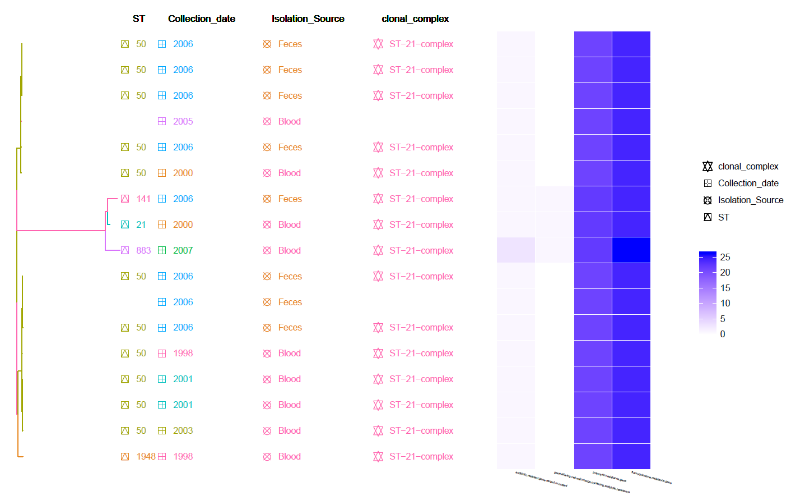

   This is a core SNP Tree (generated by Gubbins and snippy) with Meta-Data information and Heat-Map of identified Resistance genes (by CARD RGI).
   Can be found in the ``data/Tree_plot/`` directory
   
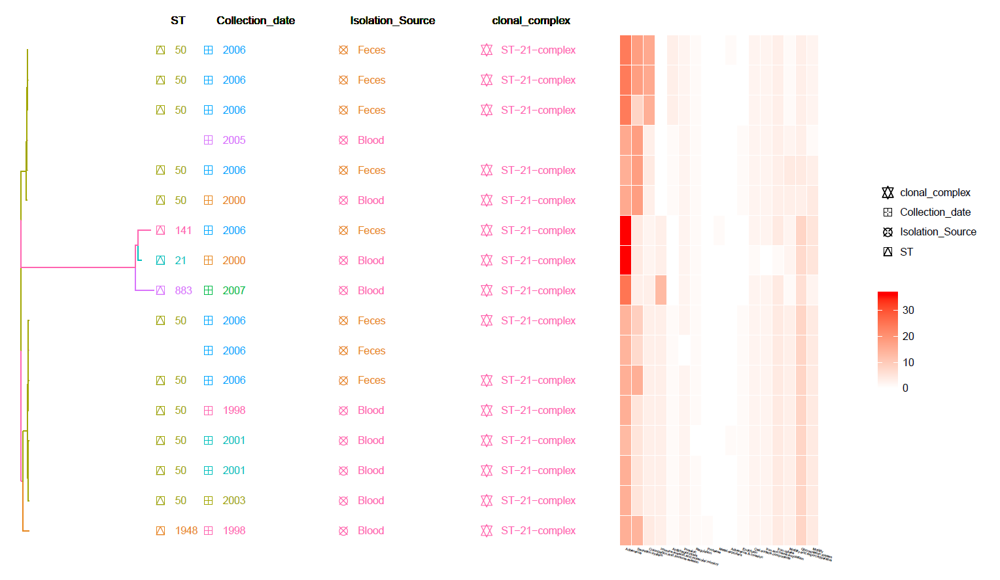
   
   This is a core SNP Tree with Meta-Data information and Heat-Map of identified Virulence genes (from VFDB).
   Can be found in the ``data/Tree_plot/`` directory
   
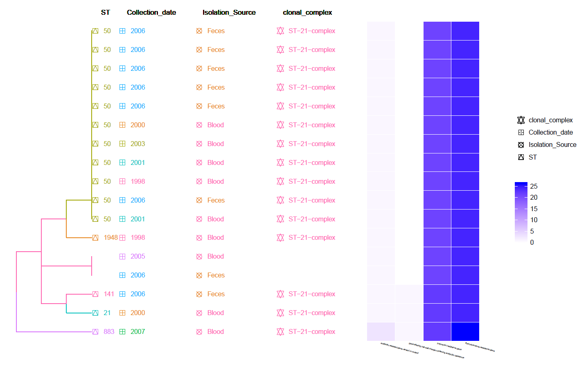

   This is a MLST Hierarchical Clustering Tree with Meta-Data information and Heat-Map of identified Resistance genes (by CARD RGI).
   Can be found in the ``data/Tree_plot/`` directory
   
   |
   
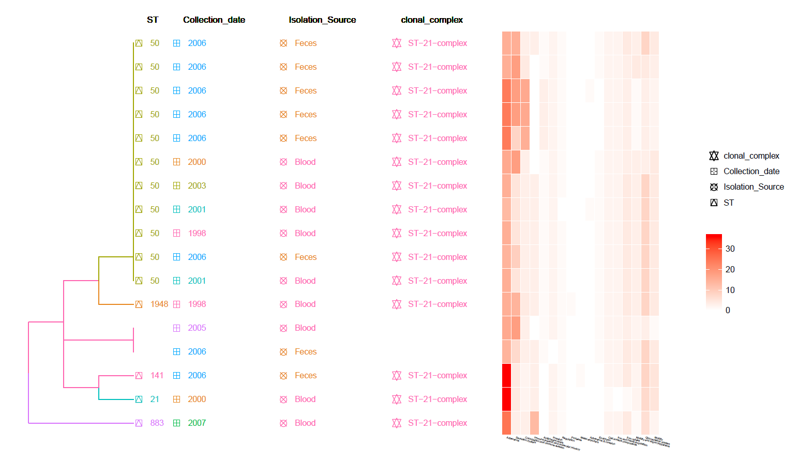
   
   This is a MLST Hierarchical Clustering Tree with Meta-Data information and Heat-Map of identified Virulence genes (from VFDB).
   Can be found in the ``data/Tree_plot/`` directory
   
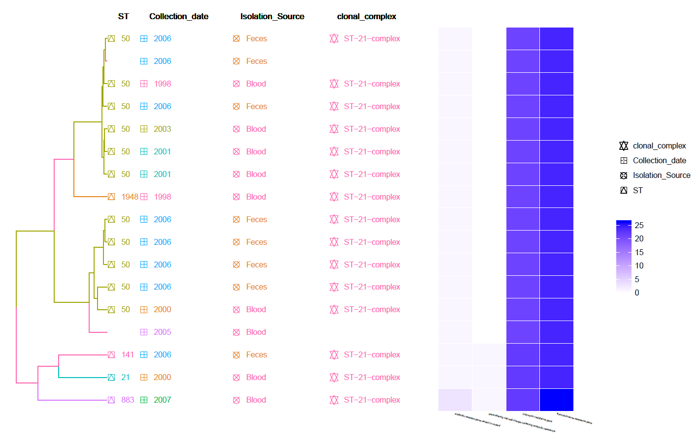
   
   This is a cgMLST Hierarchical Clustering Tree with Meta-Data information and Heat-Map of identified Resistance genes (by CARD RGI).
   Can be found in the ``data/Tree_plot/`` directory
   
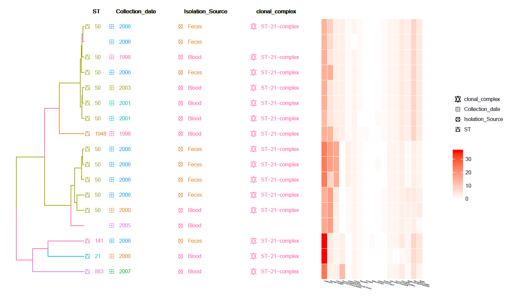
   
   This is a cgMLST Hierarchical Clustering Tree with Meta-Data information and Heat-Map of identified Virulence genes (from VFDB).
   Can be found in the ``data/Tree_plot/`` directory
   
   |
   
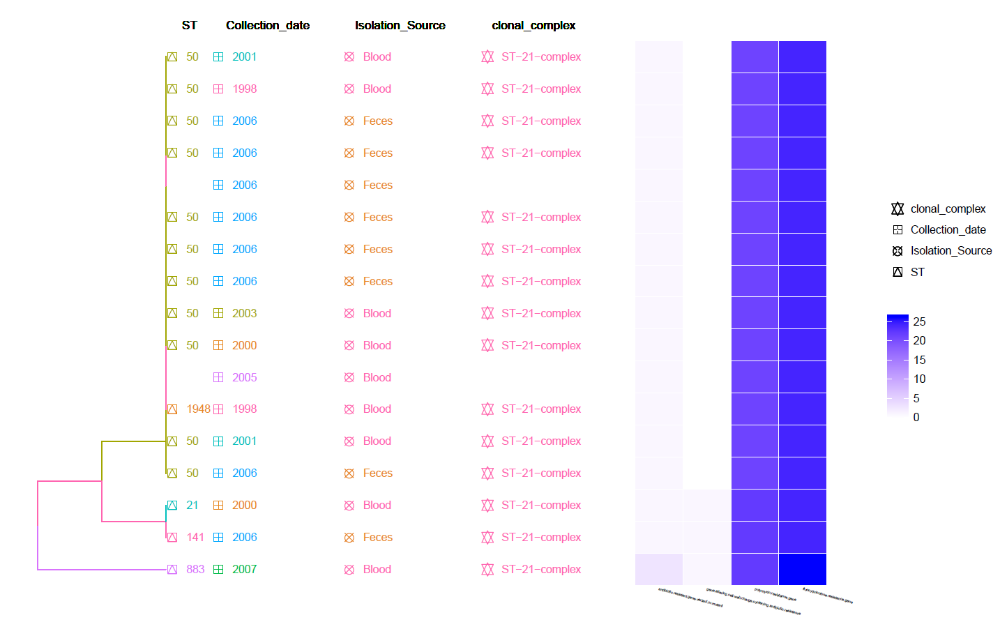
   
   This is a Hierarchical Clustering Tree generated using the identified Resistance genes (by CARD RGI) Heat-Map and with Meta-Data information. 
   Can be found in the ``data/Tree_plot/`` directory
   
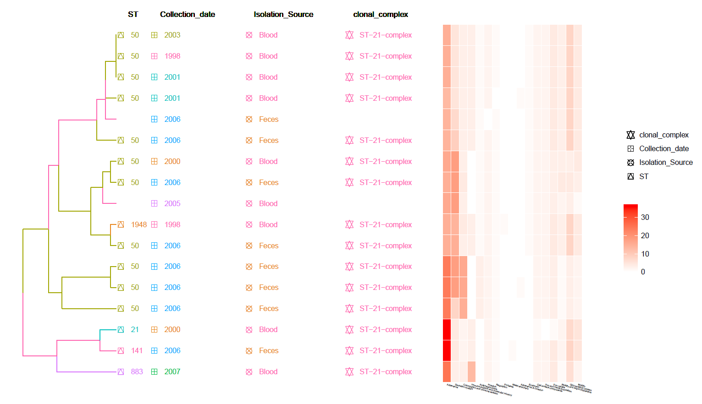
   
   This is a Hierarchical Clustering Tree generated using the identified Virulence genes (from VFDB) Heat-Map and with Meta-Data information. 
   Can be found in the ``data/Tree_plot/`` directory
   
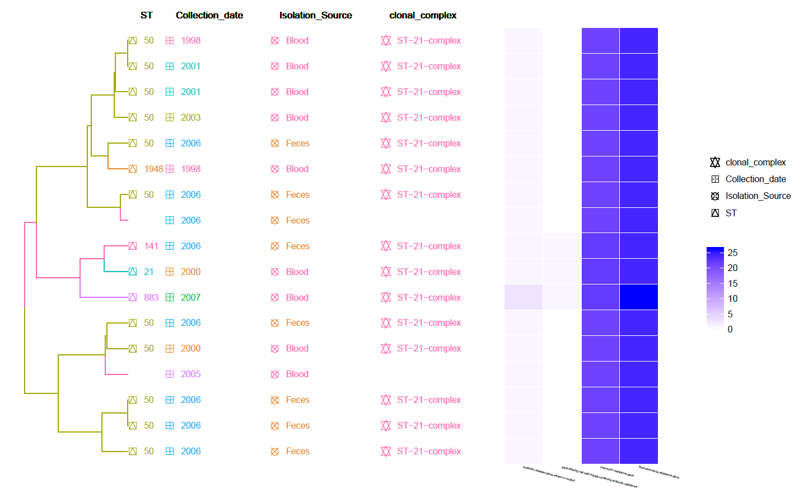
   
   This is a Hierarchical Clustering Tree generated using the Pan-genome matrix with Meta-Data information and Heat-Map of identified Resistance genes (by CARD RGI).
   Can be found in the ``data/Tree_plot/`` directory
   
   |
   
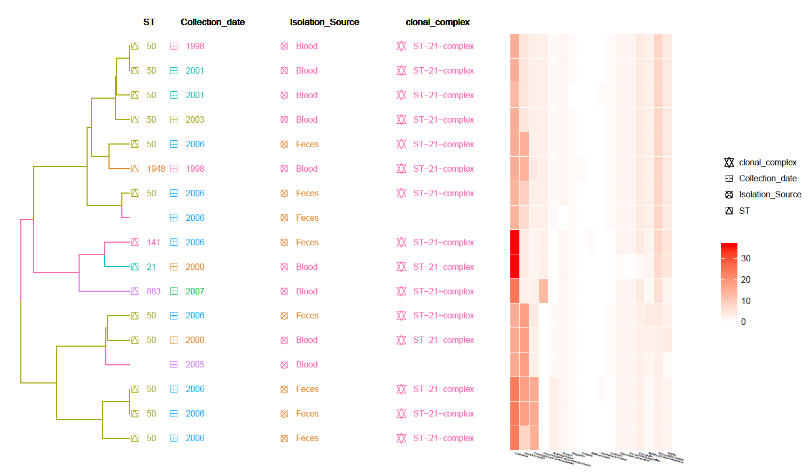
   
   This is a Hierarchical Clustering Tree generated using the Pan-genome matrix with Meta-Data information and Heat-Map of identified Virulence genes (from VFDB).
   Can be found in the ``data/Tree_plot/`` directory
   
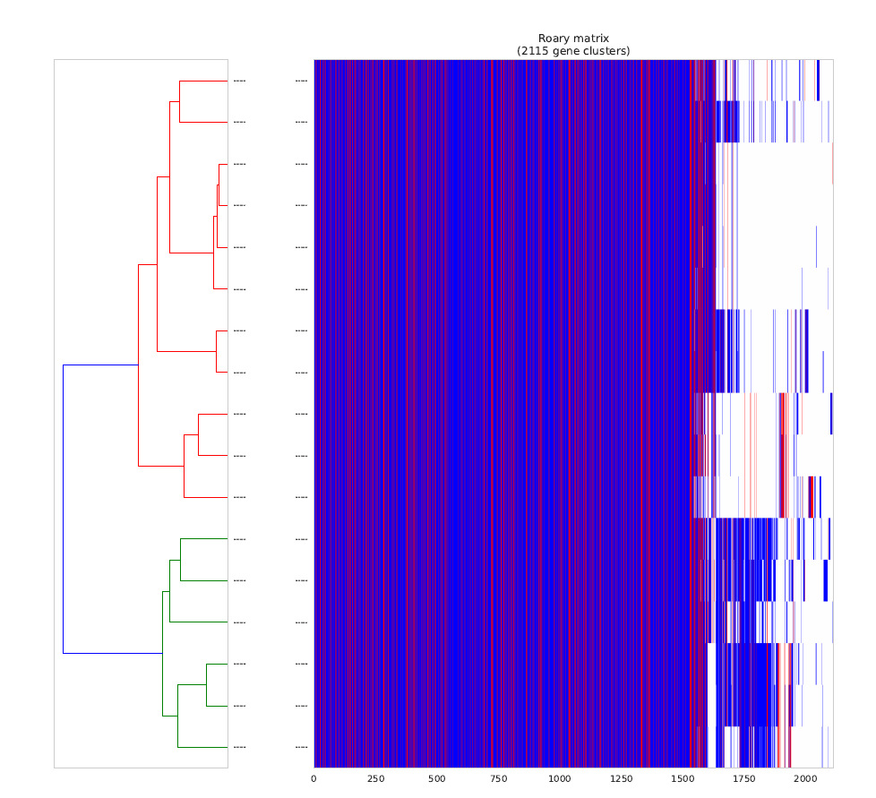
   
   This is a Hierarchical Clustering of the Pan-genome matrix [red indicate identified Virulence/Resistance genes (from VFDB)]
   Can be found in the ``data/Roary`` directory
   
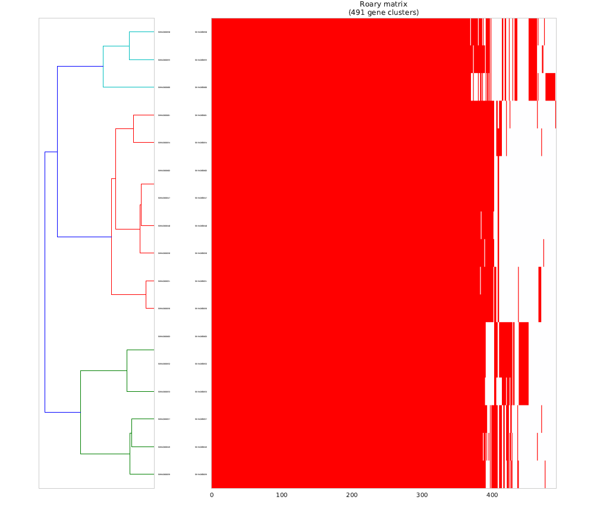
   
   This is a Hierarchical Clustering of the Pan-genome matrix using only the identified Virulence/Resistance genes (from VFDB).
   Can be found in the ``data/Roary`` directory
   
   |
   
References
~~~~~~~~~~~~~~~~~~~~~~~~~~~~
    .. [1] Martin, Marcel. "Cutadapt removes adapter sequences from high-throughput sequencing reads." EMBnet journal 17.1 (2011):pp-10
    .. [2] Krueger F: Trim Galore. [http://www.bioinformatics.babraham.ac.uk/projects/]
    .. [3] Wood DE, Salzberg SL: Kraken: ultrafast metagenomic sequence classification using exact alignments. Genome Biology 2014, 15:R46.
    .. [4] Bankevich A., Nurk S., Antipov D., Gurevich A., Dvorkin M., Kulikov A. S., Lesin V., Nikolenko S., Pham S., Prjibelski A., Pyshkin A., Sirotkin A., Vyahhi N., Tesler G., Alekseyev M. A., Pevzner P. A. SPAdes: A New Genome Assembly Algorithm and Its Applications to Single-Cell Sequencing. Journal of Computational Biology, 2012
    .. [5] Gurevich, A., Saveliev, V., Vyahhi, N. and Tesler, G., 2013. QUAST: quality assessment tool for genome assemblies. Bioinformatics, 29(8), pp.1072-1075.    
    .. [6] Ewels, P., Magnusson, M., Lundin, S. and Käller, M., 2016. MultiQC: summarize analysis results for multiple tools and samples in a single report. Bioinformatics, 32(19), pp.3047-3048.
    .. [7] Seemann, Torsten. "Prokka: rapid prokaryotic genome annotation." Bioinformatics 30.14 (2014): 2068-2069.‏
    .. [8] McArthur, A.G., Waglechner, N., Nizam, F., Yan, A., Azad, M.A., Baylay, A.J., Bhullar, K., Canova, M.J., De Pascale, G., Ejim, L. and Kalan, L., 2013. The comprehensive antibiotic resistance database. Antimicrobial agents and chemotherapy, 57(7), pp.3348-3357.
    .. [9] Torsten Seemann: Snippy. https://github.com/tseemann/snippy
    .. [10] Croucher N. J., Page A. J., Connor T. R., Delaney A. J., Keane J. A., Bentley S. D., Parkhill J., Harris S.R. "Rapid phylogenetic analysis of large samples of recombinant bacterial whole genome sequences using Gubbins". doi:10.1093/nar/gku1196, Nucleic Acids Research, 2014    
    .. [11] Rizk, Guillaume, and Dominique Lavenier. "GASSST: global alignment short sequence search tool." Bioinformatics 26.20 (2010): 2534-2540.‏    
    .. [12] Page, Andrew J., et al. "Roary: rapid large-scale prokaryote pan genome analysis." Bioinformatics 31.22 (2015): 3691-3693.‏   
    .. [13] Brynildsrud, Ola, et al. "Rapid scoring of genes in microbial pan-genome-wide association studies with Scoary." Genome biology 17.1 (2016): 238.‏
    .. [14] Csardi G, Kutalik Z and Bergmann S (2010). “Modular analysis of gene expression data with R.” Bioinformatics, 26, pp. 1376-7.
    .. [15] Yu G, Wang L, Han Y and He Q (2012). “clusterProfiler: an R package for comparing biological themes among gene clusters.” OMICS: A Journal of Integrative Biology, 16(5), pp. 284-287. doi: 10.1089/omi.2011.0118.
    .. [16] Winter, Sascha, et al. "Finding approximate gene clusters with Gecko 3." Nucleic acids research 44.20 (2016): 9600-9610.‏    
    .. [17] Nascimento, M., Sousa, A., Ramirez, M., Francisco, A. P., Carriço, J. A., & Vaz, C. (2016). PHYLOViZ 2.0: providing scalable data integration and visualization for multiple phylogenetic inference methods. Bioinformatics, 33(1), 128-129.‏
    .. [18] Yu G, Smith D, Zhu H, Guan Y and Lam TT (2017). “ggtree: an R package for visualization and annotation of phylogenetic trees with their covariates and other associated data.” Methods in Ecology and Evolution, 8, pp. 28-36. doi: 10.1111/2041-210X.12628
    .. [19] Jolley, K. A., & Maiden, M. C. (2010). BIGSdb: scalable analysis of bacterial genome variation at the population level. BMC bioinformatics, 11(1), 595.‏
    .. [20] Skarp, C. P. A., Akinrinade, O., Kaden, R., Johansson, C., & Rautelin, H. (2017). Accessory genetic content in Campylobacter jejuni ST21CC isolates from feces and blood. International Journal of Medical Microbiology, 307(4-5), 233-240.