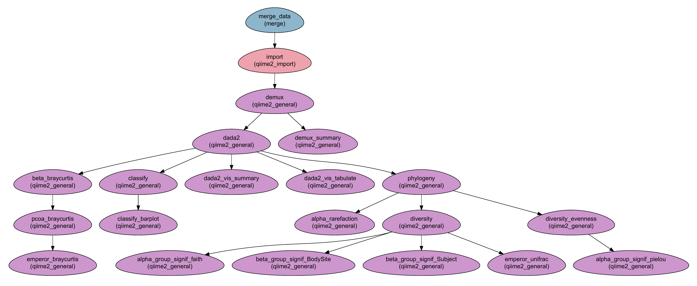

--------------------------------
Microbiome analysis using QIIME2
--------------------------------

:Author: Menachem Sklarz
:Affiliation: Bioinformatics Core Facility
:Organization: National Institute of Biotechnology in the Negev, Ben Gurion University.

The Moving Pictures tutorial
-------------------------------

A workflow for executing the `Moving Windows tutorial <https://docs.qiime2.org/2018.11/tutorials/moving-pictures/#moving-pictures-tutorial>`_ with QIIME2.

Steps:
~~~~~~~

#. *Merge_data*: Get the data and files from the sample file.
#. *Get_sequences*: Download the sequences from the internet
#. *import*: import sequence data into a QIIME2 artifact
#. *demux*: Demultiplex.
#. *demux_summary*: Show statistics of demultiplexed data
#. *dada2*: `dada2 <https://benjjneb.github.io/dada2/>`_  and visualization.

   #. *dada2_vis_summary*:
   #. *dada2_vis_tabulate*:

#. *phylogeny*: Building a phylogenetic tree
#. *diversity*: Core diversity analysis
#. *diversity_evenness*: Calculating Pielou's evenness index.
#. Comparing alpha and beta groups differences.

   #. *alpha_group_signif_faith*: alpha groups differences based on Faith's diversity index.
   #. *alpha_group_signif_pielou*:  alpha groups differences based on Pielou's evenness index.
   #. *beta_group_signif_BodySite*: beta groups differences based on site in body.
   #. *beta_group_signif_Subject*:  beta groups differences based on subject.

#. Creating emperor visualizations.

   #. *emperor_unifrac*: Emperor visualization based on UniFrac index.
   #. *beta_braycurtis*, *pcoa_braycurtis* and *emperor_braycurtis*: Emperor visualization based on Bray-Curtis index.

#. *alpha_rarefaction*: Creating &alpha;-rarefaction curves.
#. *Taxonomy*:

   #. *classify*: taxonomic classification
   #. *classify_barplot*: taxonomy visualization with barplots.

Workflow Schema
~~~~~~~~~~~~~~~~

Requires
~~~~~~~~

No requirements. All files are downloaded by the workflow.

Programs required
~~~~~~~~~~~~~~~~~~

* `QIIME2 <https://qiime2.org/>`_, version 2018.11, `installed with conda as described here <https://docs.qiime2.org/2018.11/install/native/#natively-installing-qiime-2>`_.

.. Attention:: Download the parameter file in the link below and set the conda path in line 10 to the location of your conda installation, not including ``bin``. *e.g.*, if using the default location of miniconda, the path should be ``$HOME/miniconda2``.

Download
~~~~~~~~~

The workflow and sample files are available for download with the following commands::

   wget https://raw.githubusercontent.com/bioinfo-core-BGU/neatseq-flow3-modules/master/Workflows/qiime2_MovingPic_fullAuto.params.yaml
   wget https://raw.githubusercontent.com/bioinfo-core-BGU/neatseq-flow3-modules/master/Workflows/qiime2_MovingPic_fullAuto.samples.nsfs

.. :download:`here <../../../Workflows/qiime2_MovingPic_fullAuto.params.yaml>`
.. * The sample file is available :download:`here <../../../Workflows/qiime2_MovingPic_fullAuto.samples.nsfs>`

