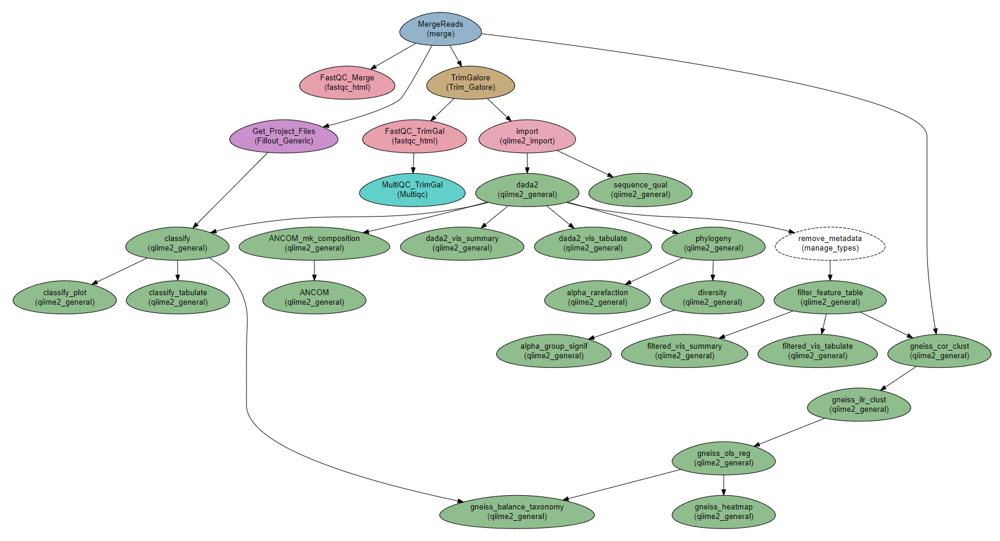
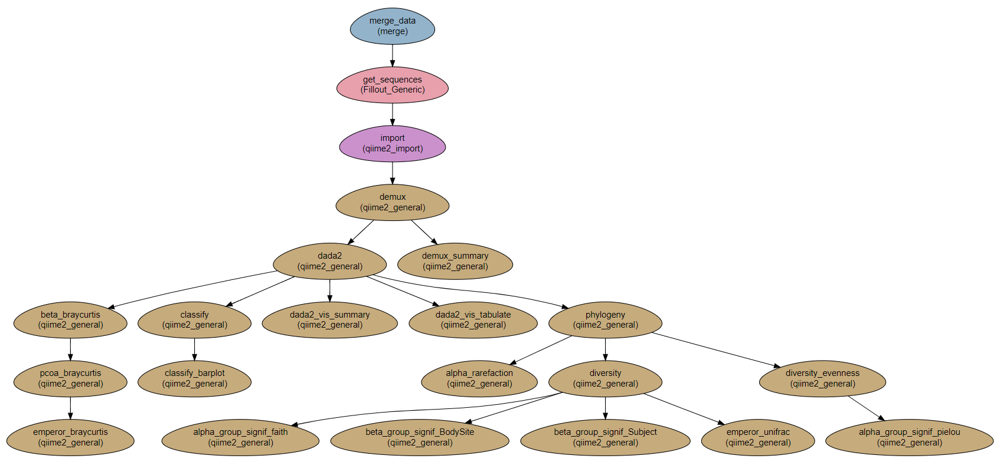

--------------------------------
Microbiome analysis using QIIME2
--------------------------------

:Author: Menachem Sklarz
:Affiliation: Bioinformatics Core Facility
:Organization: National Institute of Biotechnology in the Negev, Ben Gurion University.

.. contents:: Page Contents:
   :depth: 1
   :local:
   :backlinks: top

.. Attention:: This workflow is in active development!

Captive and Wild Atlantic Salmon project
--------------------------------------------

This workflow is based on the data described in *Structural and compositional mismatch between captive and wild Atlantic salmon (Salmo salar) parrs gut microbiota highlights the relevance of integrating molecular ecology for management and conservation methods* [#f1]_.

The data for the workflow is available on `datadryad <https://datadryad.org/resource/doi:10.5061/dryad.5ff8m0q>`_.

Steps
~~~~~~~~~~

#. *MergeReads*: Get the data and files from the sample file.
#. *FastQC_Merge*, *TrimGalore*, *FastQC_TrimGal*, and *MultiQC_TrimGal*: QC on the reads: FastQC and Trim Galore!. Depending on the quality of the reads, `TrimGalore`` might not be required.
#. *Get_Project_Files*: Download and import the metadata and classifier files into the workflow.
#. *import*: import sequence data into a QIIME2 artifact
#. *sequence_qual*: Create quality report for the sequences.
#. *dada2*: `dada2 <https://benjjneb.github.io/dada2/>`_  and visualization.

   #. *dada2_vis_summary*:
   #. *dada2_vis_tabulate*:

#. *remove_metadata* and *filter_feature_table*: Filter low-expression features from the feature table (have to first remove metadata slot, to avoid filtering by metadata)

   #. *filtered_vis_summary* and *filtered_vis_tabulate*: Visualization of the filtered table.

   .. Tip:: From this step onwards, if you want to use the filtered feature table, base your steps on *filter_feature_table*.

#. *phylogeny*: Building a phylogenetic tree
#. *diversity*: Core diversity analysis
#. *alpha_rarefaction*: Creating &alpha;-rarefaction curves.
#. *alpha_group_signif*: alpha groups differences based on Faith's diversity index.
#. Classification:

   #. Using the classifier downloaded in step *Get_Project_Files*.

      .. Tip:: You can add steps in the workflow to `train your own classifier <https://docs.qiime2.org/2018.11/tutorials/feature-classifier/>`_, but that is beyond the scope of this workflow.

   #. *classify*: Classify the reads.
   #. *classify_tabulate* and *classify_plot*: Visualization of the classification.

#. *gneiss_**: Steps for executing the gneiss analysis
#. *ANCOM**: Steps for executing the ANCOM analysis

Workflow Schema
~~~~~~~~~~~~~~~~

Requires
~~~~~~~~

#. Raw reads for the analysis can be downloaded as follows (Note: The downloaded directory is 5.5 GB!):

   .. code-block:: bash

      curl -sl https://datadryad.org/bitstream/handle/10255/dryad.181830/16S_reads_salmo_salar_V3_V4_gut_microbiota.tar.gz | tar zxv

#. Get :download:`the salmon sample file <../_extra/QIIME2/qiime2.samples.salmon.yaml>` with:

   .. code-block:: bash

      curl -LO https://raw.githubusercontent.com/bioinfo-core-BGU/neatseq-flow-modules/master/docs/source/_extra/QIIME2/qiime2.samples.salmon.yaml

#. Modify the paths in the sample file to the **correct full paths**.

.. Tip:: If the raw read directory (``16S_reads_salmo_salar_V3_V4_gut_microbiota``) and the sample file are in the same path, you can set the paths with the following sed command:

   .. code-block:: bash

      sed -i s+/path/to/+$PWD/16S_reads_salmo_salar_V3_V4_gut_microbiota/+ qiime2.samples.salmon.yaml

Programs required
~~~~~~~~~~~~~~~~~~

* `QIIME2 <https://qiime2.org/>`_, version 2019.4, `installed with conda as described here <https://docs.qiime2.org/2019.4/install/native/#natively-installing-qiime-2>`_.

.. Attention:: Download the parameter file in the link below and set the conda ``path`` in the ``Global_params`` section to the location of your conda installation, not including ``bin``. *e.g.*, if using the default location of miniconda, the path should be ``$HOME/miniconda2``. The ``env`` in the same section should be the name of the qiime environment, typically something like *qiime2-2018.11*.

* ``fastqc``, ``multiqc``, ``TrimGalore!`` and ``cutadapt`` which are not included in the qiime2 environment. All of these can be installed in a separate conda environment with:

   .. code-block:: bash

      curl -LO https://raw.githubusercontent.com/bioinfo-core-BGU/neatseq-flow-modules/master/docs/source/_extra/QC_conda.yaml
      conda env create -f QC_conda.yaml

   You can also :download:`download the file from here <../_extra/QC_conda.yaml>`

Download
~~~~~~~~~

The workflow file is available for download with the following command::

   curl -LO https://raw.githubusercontent.com/bioinfo-core-BGU/neatseq-flow-modules/master/Workflows/qiime2.analysis.salmon.yaml

Execute NeatSeq-Flow
~~~~~~~~~~~~~~~~~~~~~~

`Execute NeatSeq-Flow <https://neatseq-flow.readthedocs.io/en/latest/02b.execution.html#executing-neatseq-flow>`_ with the sample and parameters files downloaded above:

   .. code-block:: bash

      source activate NeatSeq_Flow
      neatseq_flow.py -s qiime2.samples.salmon.yaml -p qiime2.analysis.salmon.yaml

.. Tip:: See also `this nice presentation <http://evomicsorg.wpengine.netdna-cdn.com/wp-content/uploads/2015/07/cfar_lab_09182015.pdf>`_ by Galeb Abu-Ali, Eric Franzosa and Curtis Huttenhower

.. [#f1] `<https://onlinelibrary.wiley.com/doi/full/10.1111/eva.12658>`_

The Moving Pictures tutorial
-------------------------------

A workflow for executing the `Moving Windows tutorial <https://docs.qiime2.org/2018.11/tutorials/moving-pictures/#moving-pictures-tutorial>`_ with QIIME2.

Steps:
~~~~~~~

#. *Merge_data*: Get the data and files from the sample file.
#. *Get_sequences*: Download the sequences from the internet
#. *import*: import sequence data into a QIIME2 artifact
#. *demux*: Demultiplex.
#. *demux_summary*: Show statistics of demultiplexed data
#. *dada2*: `dada2 <https://benjjneb.github.io/dada2/>`_  and visualization.

   #. *dada2_vis_summary*:
   #. *dada2_vis_tabulate*:

#. *phylogeny*: Building a phylogenetic tree
#. *diversity*: Core diversity analysis
#. *diversity_evenness*: Calculating Pielou's evenness index.
#. Comparing alpha and beta groups differences.

   #. *alpha_group_signif_faith*: alpha groups differences based on Faith's diversity index.
   #. *alpha_group_signif_pielou*:  alpha groups differences based on Pielou's evenness index.
   #. *beta_group_signif_BodySite*: beta groups differences based on site in body.
   #. *beta_group_signif_Subject*:  beta groups differences based on subject.

#. Creating emperor visualizations.

   #. *emperor_unifrac*: Emperor visualization based on UniFrac index.
   #. *beta_braycurtis*, *pcoa_braycurtis* and *emperor_braycurtis*: Emperor visualization based on Bray-Curtis index.

#. *alpha_rarefaction*: Creating &alpha;-rarefaction curves.
#. *Taxonomy*:

   #. *classify*: taxonomic classification
   #. *classify_barplot*: taxonomy visualization with barplots.

Workflow Schema
~~~~~~~~~~~~~~~~

Requires
~~~~~~~~

No requirements. All files are downloaded by the workflow.

Programs required
~~~~~~~~~~~~~~~~~~

* `QIIME2 <https://qiime2.org/>`_, version 2018.11, `installed with conda as described here <https://docs.qiime2.org/2018.11/install/native/#natively-installing-qiime-2>`_.

.. Attention:: Download the parameter file in the link below and set the conda path in line 10 to the location of your conda installation, not including ``bin``. *e.g.*, if using the default location of miniconda, the path should be ``$HOME/miniconda2``.

Download
~~~~~~~~~

The workflow and sample files are available for download with the following commands::

   curl -LO https://raw.githubusercontent.com/bioinfo-core-BGU/neatseq-flow-modules/master/Workflows/qiime2_MovingPic_fullAuto.params.yaml
   curl -LO https://raw.githubusercontent.com/bioinfo-core-BGU/neatseq-flow-modules/master/Workflows/qiime2_MovingPic_fullAuto.samples.nsfs

.. :download:`here <../../../Workflows/qiime2_MovingPic_fullAuto.params.yaml>`
.. * The sample file is available :download:`here <../../../Workflows/qiime2_MovingPic_fullAuto.samples.nsfs>`

