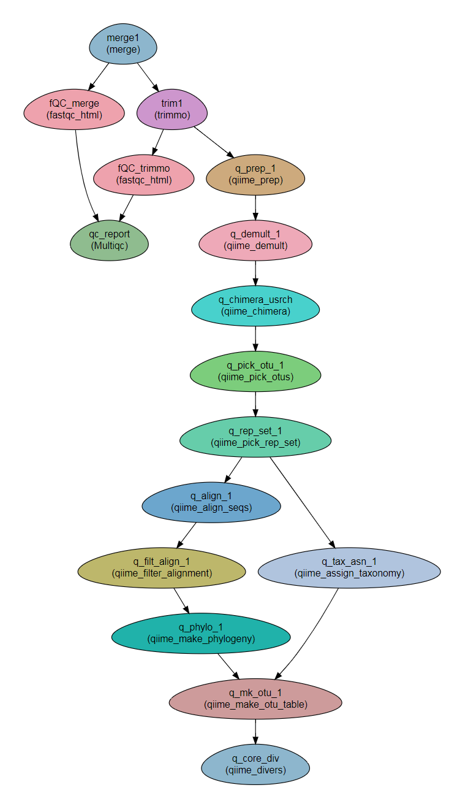

QIIME analysis
---------------------

A workflow for executing a complete QIIME analysis (based on `QIIME 1.9. <http://qiime.org/>`_. A new workflow for `QIIME2 <https://qiime2.org/>`_ is in the making)

**Developed as part of a study led by Prof. Jacob Moran-Gilad.**
 
Steps:
~~~~~~~

1. Read preparation:
    1. merge
    2. trimmomatic - For cleaning the reads
    3. FastQC - Checking the quality of the reads
    4. MultiQC
    5. Optional read joining with join_paired_ends.py (module ``qiime_prep``)
    6. Creating symbolic links to files so that demultiplication can recognise the sample names from the link names. 
    7. Further QA and concatenating all sequences into a single fasta file with ``qiime_demult``.
    8. Identifying chimeric sequences (``qiime_chimera`` module`)
2. Analysis (denovo OTU picking)
    1. OTU picking
    2. selecting representative sequences
    3. Aligning to reference and filtering the alignment
    4. Assigning taxonomic lineage to representative sequences
    5. Creating phylogenetic tree
    6. Creating BIOM table 
    7. Computing core diversity analyses on the BIOM table.
3. Optional 
    1. You can filter out particular samples or OTUs with modules ``qiime_filter_samples_from_otu_table`` and ``qiime_filter_otus``, respectively.
    2. You can sort the BIOM table samples by a specific field of the mapping file with the ``qiime_sort_otu_table`` module
        
        
        
Workflow Schema
~~~~~~~~~~~~~~~~

Requires
~~~~~~~~

`fastq` files. Paired end or single-end.

Programs required
~~~~~~~~~~~~~~~~~~

* `FastQC       <https://www.bioinformatics.babraham.ac.uk/projects/fastqc/>`_
* `trimmomatic  <http://www.usadellab.org/cms/?page=trimmomatic>`_
* `QIIME        <http://qiime.org/>`_

Example of Sample File
~~~~~~~~~~~~~~~~~~~~~~

::

    Title	Metagenomics

    #SampleID	Type	Path    lane
    Sample1	Forward	/path/to/Sample1_F1.fastq.gz 1
    Sample1	Forward	/path/to/Sample1_F2.fastq.gz 2
    Sample1	Reverse	/path/to/Sample1_R1.fastq.gz 1
    Sample1	Reverse	/path/to/Sample1_R2.fastq.gz 2
    Sample2	Forward	/path/to/Sample2_F1.fastq.gz 1
    Sample2	Reverse	/path/to/Sample2_R1.fastq.gz 1
    Sample2	Forward	/path/to/Sample2_F2.fastq.gz 2
    Sample2	Reverse	/path/to/Sample2_R2.fastq.gz 2

Download
~~~~~~~~~

The workflow file is available :download:`here <../../../Workflows/parameter_set_QIIME/QIIME_workflow.yaml>`

