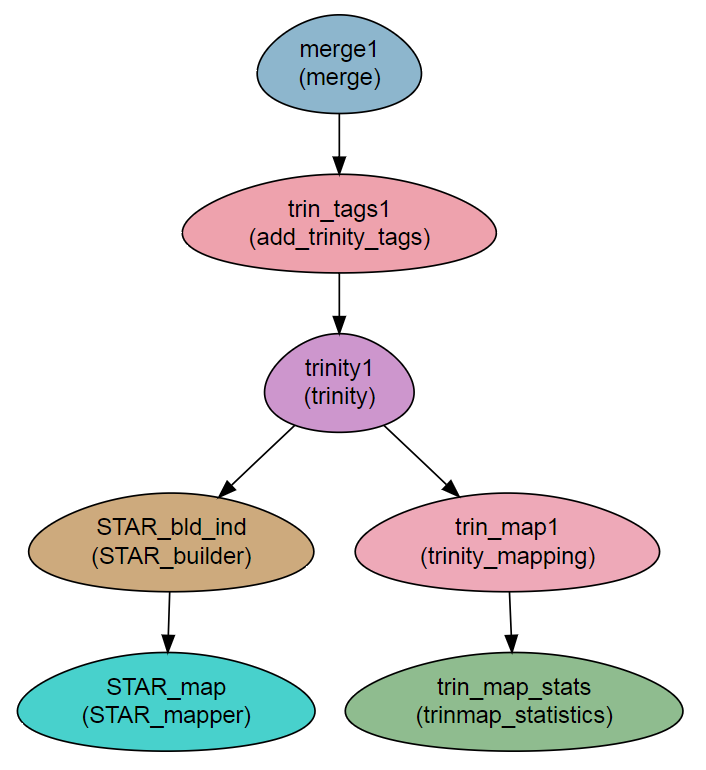

RNA-Seq without a reference genome, using Trinity 
-------------------------------------------------

:Author: Menachem Sklarz
:Affiliation: Bioinformatics Core Facility
:Organization: National Institute of Biotechnology in the Negev, Ben Gurion University.

A pipeline for RNA-seq analysis using Trinity.

The workflow is built to run Trinity's sample data, which consists of stranded, paired-end reads. You should modify the workflow steps to suit your data.

The workflow assembles a transcriptome with `Trinity` and then runs ``align_and_estimate_abundance.pl`` and ``abundance_estimates_to_matrix.pl`` to map the reads to the trascriptome and create normalized counts tables. These tables can then be used in `DEseq2` or other tools for statistical analysis of RNA-seq data.

Finally, the workflow uses Trinotate to annotate the resulting transcriptome.

Preparatorty steps:
~~~~~~~~~~~~~~~~~~~~~~~~~

#. Create a conda environment with all the required programs::

   curl -l

Steps:
~~~~~~~

#. Concatenating the read files into single files per direction (``merge``)
#. QC on the reads: FastQC and trimmomatic. Depending on the quality of the reads, `trimmomatic`` might noit be required.
#. Adding tags required by trinity to the read titles (/1 and /2 for F and R. See `Running-Trinity <https://github.com/trinityrnaseq/trinityrnaseq/wiki/Running-Trinity>`_. [1]_
#. Running ``Trinity``. Trinity must be configured to run on a cluster. The configuration file is set in the ``SGE_Trinity_conf`` variable in the ``Vars`` section. [2]_
#. Mapping of the reads is performed with ``trinity_mapping`` module.
#. Creating statistical tables is performed with ``trinity_statistics`` module.

.. [1] Since the Trinity example already includes tags in the read names, this step is tagged with ``SKIP``, and will not be executed. For raw fastq reads, you will need to remove the ``SKIP`` tag.
.. [2] Trinity uses `hpc_cmds_GridRunner <https://github.com/HpcGridRunner/HpcGridRunner.github.io/wiki>`_ for executing on grids. See their wiki for correct configuration.

Workflow Schema
~~~~~~~~~~~~~~~~

Requires
~~~~~~~~

`fastq` files. Paired end or single-end.

Programs required
~~~~~~~~~~~~~~~~~~

* `bowtie2      <http://bowtie-bio.sourceforge.net/bowtie2/index.shtml>`_
* `Trinity      <https://github.com/trinityrnaseq/trinityrnaseq/wiki>`_
* `RSEM         <https://deweylab.github.io/RSEM/>`_
* `samtools     <http://www.htslib.org/>`_
* `blast          <https://blast.ncbi.nlm.nih.gov/Blast.cgi>`_
* `hmmer          <http://hmmer.org/>`_
* `Trinotate      <https://github.com/Trinotate/Trinotate.github.io/wiki>`_

Example of Sample File
~~~~~~~~~~~~~~~~~~~~~~

::

    Title	RNA_seq_denovo

    #SampleID	Type	Path    lane
    Sample1	Forward	/path/to/Sample1_F1.fastq.gz 1
    Sample1	Forward	/path/to/Sample1_F2.fastq.gz 2
    Sample1	Reverse	/path/to/Sample1_R1.fastq.gz 1
    Sample1	Reverse	/path/to/Sample1_R2.fastq.gz 2
    Sample2	Forward	/path/to/Sample2_F1.fastq.gz 1
    Sample2	Reverse	/path/to/Sample2_R1.fastq.gz 1
    Sample2	Forward	/path/to/Sample2_F2.fastq.gz 2
    Sample2	Reverse	/path/to/Sample2_R2.fastq.gz 2

Download
~~~~~~~~~

The workflow file is available :download:`here <../../../Workflows/RNA_seq_Trinity.yaml>`

Quick start with conda
~~~~~~~~~~~~~~~~~~~~~~~

For easy setup of the workflow, use the following instructions for complete installation with conda:

1. Install the workflow environment with::

2. Install the NeatSeq-Flow environment with::

3. Create a directory for the workflow and change into it::

4. Activate the workflow environment with::

5. Install `HpcGridRunner` with::

    cd $CONDA_PREFIX/opt
    git clone https://github.com/HpcGridRunner/HpcGridRunner.git
    ln -s $CONDA_PREFIX/opt/HpcGridRunner/hpc_cmds_GridRunner.pl $CONDA_PREFIX/bin/
    cd -

6. Copy template of cluster configuration file with::

   cp $CONDA_PREFIX/opt/HpcGridRunner/hpc_conf/BroadInst_UGER.conf ./

7. Get and build the trinotate databases with::

   Build_Trinotate_Boilerplate_SQLite_db.pl trino_test
   makeblastdb -in uniprot_sprot.pep -dbtype prot
   hmmpress Pfam-A.hmm

8. Get and appropriate BUSCO dataset from `<https://busco.ezlab.org/frame_wget.html>`_.
