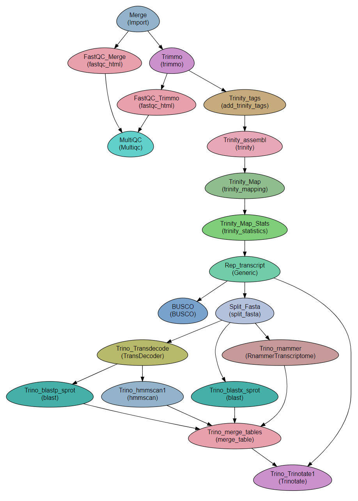

*de-novo* RNA-seq using Trinity
--------------------------------------------------------------

.. include:: ../links.rst

:Author: Menachem Sklarz
:Affiliation: Bioinformatics Core Facility
:Organization: National Institute of Biotechnology in the Negev, Ben Gurion University.

A pipeline for RNA-seq analysis using Trinity.

The workflow is built to run Trinity's sample data, which consists of stranded, paired-end reads. You should modify the workflow steps to suit your data.

The workflow assembles a transcriptome with ``Trinity`` and then runs ``align_and_estimate_abundance.pl`` and ``abundance_estimates_to_matrix.pl`` to map the reads to the trascriptome and create normalized counts tables. The tables are used to select a representative transcript per gene, by expression.

Finally, the workflow uses Trinotate to annotate the resulting transcriptome.

Preparatory steps
~~~~~~~~~~~~~~~~~~~

#. If you want to use Trinotate, you must create and define the Trinotate databases [#f3]_.

   If you already have the Trinotate databases downloaded and setup, you can set the paths to the databases in the ``databases`` subsection of the ``Vars`` section in the parameter file.

   See section `Quick start with conda`_ below for creating the databases with a conda installation.

#. If you want to use BUSCO:

    #. Download a template config file with the following command and edit is as necessary. In the parameter file, set Vars.paths.BUSCO_cfg to the full path to the config file.

        ::

            wget -O config.ini https://gitlab.com/ezlab/busco/raw/master/config/config.ini.default

    #. Set the Vars.databases.BUSCO variable to the URL or the BUSCO dataset to use. Choose a URL from this list: `<https://busco.ezlab.org/frame_wget.html>`_.

Steps
~~~~~~~

#. Importing and QC

    #. *Merge*: Concatenating the read files into single files per direction
    #. *FastQC_Merge*, *Trimmo*, *FastQC_Trimmo* and *MultiQC*: QC on the reads: FastQC and trimmomatic. Depending on the quality of the reads, `trimmomatic`` might not be required.

#. Trinity

    #. *Trinity_tags*: Adding tags required by trinity to the read titles (/1 and /2 for F and R. See `Running-Trinity <https://github.com/trinityrnaseq/trinityrnaseq/wiki/Running-Trinity>`_. [#f1]_
    #. *Trinity_assembl*: Running ``Trinity``. In this workflow, Trinity is executed on a single computer. Trinity can be configured to run on a cluster. The configuration file is set in the ``SGE_Trinity_conf`` variable in the ``Vars`` section. [#f2]_
    #. *Trinity_Map*: Mapping of the reads is performed with ``trinity_mapping`` module.
    #. *Trinity_Map_Stats*: Creating statistical tables is performed with ``trinity_statistics`` module.
    #. *Rep_transcript*: Uses filter_low_expr_transcripts.pl to keep only a single transcript per gene.
    #. *BUSCO*: Run BUSCO on the transcripts file. See `Preparatory steps`_ above for setting up BUSCO in the parameter file.

#. Trinotate

    #. *Split_Fasta*: Splits the fasta file of transcripts for parallelization.
        From this step onwards, analysis is performed on subsets of the transcriptome. Recombining the results is done in step *Trino_merge_tables*.
    #. *Trino_blastx_sprot*: Runs blastx against swissprot with the transcript sequences.
    #. *Trino_Transdecode*: Finds coding sequences in the transcripts and produces predicted protein sequences.
    #. *Trino_blastp_sprot*: Runs blastp against swissprot with the translated transcript sequences.
    #. *Trino_hmmscan1*: Runs hmmscan against PFAM-A database with the translated transcript sequences.
    #. *Trino_rnammer*: Runs RNAMMER to predict rRNA sequences in the transcripts.

        .. Note:: RNAMMER has to be set up in a special way. See here: `<https://github.com/Trinotate/Trinotate.github.io/wiki/Software-installation-and-data-required#rnammer-free-academic-download>`_.
    #. *Trino_merge_tables*: Merges the tables produced in the previous steps for the transcript subsamples.
    #. *Trino_Trinotate1*: Read the tables and produce the final annotation file.

.. [#f3] See instructions here: `<https://github.com/Trinotate/Trinotate.github.io/wiki/Software-installation-and-data-required#2-sequence-databases-required>`_.
.. [#f1] For the Trinity example described below (), this step can be tagged with ``SKIP``, since the reads names already include tags.
.. [#f2] Trinity uses `hpc_cmds_GridRunner <https://github.com/HpcGridRunner/HpcGridRunner.github.io/wiki>`_ for executing on grids. See their wiki for correct configuration.

Workflow Schema
~~~~~~~~~~~~~~~~

Requires
~~~~~~~~

`fastq` files. Paired end or single-end.

Programs required
~~~~~~~~~~~~~~~~~~

* `bowtie2      <http://bowtie-bio.sourceforge.net/bowtie2/index.shtml>`_
* `Trinity      <https://github.com/trinityrnaseq/trinityrnaseq/wiki>`_
* `RSEM         <https://deweylab.github.io/RSEM/>`_
* `samtools     <http://www.htslib.org/>`_
* `blast          <https://blast.ncbi.nlm.nih.gov/Blast.cgi>`_
* `hmmer          <http://hmmer.org/>`_
* `Trinotate      <https://github.com/Trinotate/Trinotate.github.io/wiki>`_
* busco
* transdecoder
* multiqc
* fastqc
* trimmomatic

.. Tip:: See section `Quick start with conda`_ for installing all the programs with conda.

Example of Sample File
~~~~~~~~~~~~~~~~~~~~~~

::

    Title	RNA_seq_denovo

    #SampleID	Type	Path    lane
    Sample1	Forward	/path/to/Sample1_F1.fastq.gz 1
    Sample1	Forward	/path/to/Sample1_F2.fastq.gz 2
    Sample1	Reverse	/path/to/Sample1_R1.fastq.gz 1
    Sample1	Reverse	/path/to/Sample1_R2.fastq.gz 2
    Sample2	Forward	/path/to/Sample2_F1.fastq.gz 1
    Sample2	Reverse	/path/to/Sample2_R1.fastq.gz 1
    Sample2	Forward	/path/to/Sample2_F2.fastq.gz 2
    Sample2	Reverse	/path/to/Sample2_R2.fastq.gz 2

Download
~~~~~~~~~

The workflow file is available for download with the following command::

   wget https://raw.githubusercontent.com/bioinfo-core-BGU/neatseq-flow3-modules/master/Workflows/RNA_seq_Trinity.yaml

Quick start with conda
~~~~~~~~~~~~~~~~~~~~~~~

For easy setup of the workflow, including a sample dataset, use the following instructions for complete installation with conda:

#. Create and activate a conda environment with all the required programs::

    wget https://raw.githubusercontent.com/bioinfo-core-BGU/neatseq-flow3-modules/master/docs/source/Workflow_docs/RNA_seq_Trinity_conda.yaml
    conda env create -f RNA_seq_Trinity_conda.yaml
    conda activate RNA_trinity

#. Get the raw data from Trinity::

    mkdir 00.Raw_reads
    cp $CONDA_PREFIX/opt/trinity-2.8.4/Docker/test_data/reads.right.fq.gz 00.Raw_reads/
    cp $CONDA_PREFIX/opt/trinity-2.8.4/Docker/test_data/reads.left.fq.gz 00.Raw_reads/

#. Create a sample file. It should look like the following, only the file names should be replaced with absolute file names::

        Title   Trinity_example

        #SampleID       Type    Path
        Sample1 Forward 00.Raw_reads/reads.right.fq.gz
        Sample1 Reverse 00.Raw_reads/reads.left.fq.gz

   .. Tip:: To get the full path to a file, use the following command:

      .. code-block:: bash

         readlink -f 00.Raw_reads/reads.left.fq.gz

#. Get the parameter file with::

    wget https://raw.githubusercontent.com/bioinfo-core-BGU/neatseq-flow3-modules/master/Workflows/RNA_seq_Trinity.yaml

#. In the conda definitions (line 46), set ``base:`` to the path to the conda installation which you used to install the environment.

    You can get the path by executing the following command::

        echo $CONDA_EXE | sed -e 's/\/bin\/conda$//g'

#. If you want to use Trinotate, create a directory for the required databases (this step takes some time to complete)::

    mkdir Trinotate_dbs;
    Build_Trinotate_Boilerplate_SQLite_db.pl  Trinotate_dbs/Trinotate

    mv uniprot_sprot.* Trinotate_dbs/
    mv Pfam-A.hmm.gz Trinotate_dbs/
    cd Trinotate_dbs/
    makeblastdb -in uniprot_sprot.pep -dbtype prot
    gunzip Pfam-A.hmm.gz
    hmmpress Pfam-A.hmm
    cd -

.. Attention:: If you already have the Trinotate databases downloaded and setup, you do not have to do the last steps. You can set the paths to the databases in the ``databases`` subsection of the ``Vars`` section in the parameter file.

#. If you want to use BUSCO:

    #. Download a template config file with the following command and edit is as necessary::

        wget -O config.ini https://gitlab.com/ezlab/busco/raw/master/config/config.ini.default

    #. Set the Vars.databases.BUSCO variable to the URL or the BUSCO dataset to use. Choose a URL from this list: `<https://busco.ezlab.org/frame_wget.html>`_.

#. `Execute NeatSeq-Flow  <https://neatseq-flow3.readthedocs.io/en/latest/02b.execution.html#executing-neatseq-flow>`_.
