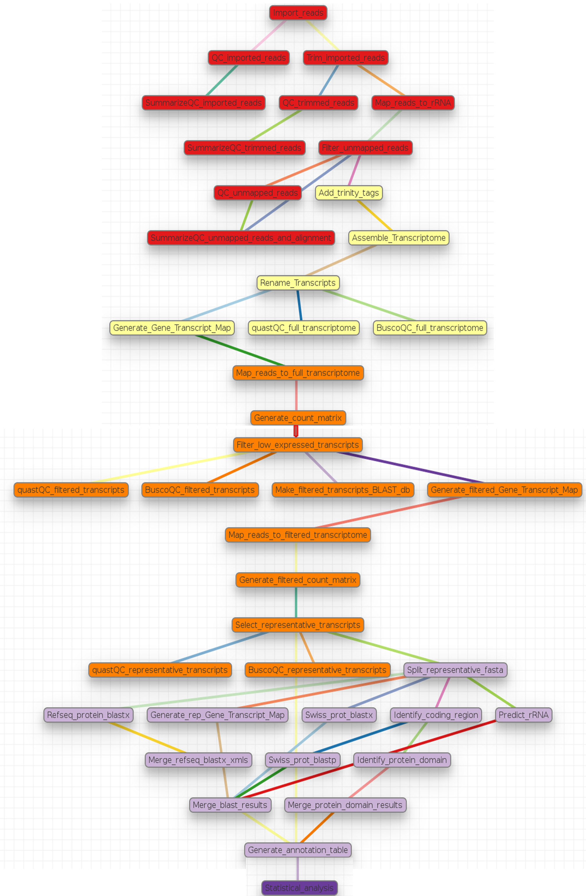

*****************************************
RNA-Seq analysis for non-model organisms
*****************************************

:Authors: Olabiyi Obayomi, Menachem Sklarz, Liron Levin, Vered Chalifa-Caspi
:Affiliation: Bioinformatics Core Facility
:E-mail: obadbotanist@yahoo.com
:Organization: Ben Gurion University of the Negev, Beer-Sheva.

Introduction
~~~~~~~~~~~~~

Human and model organisms, such as mouse and *Arabidopsis*, typically have high quality genome sequences which can serve as reference for RNA-Seq analysis, and a rich assortment of tools are available for their downstream functional and pathway analyses. In contrast, non-model organisms usually have low quality (draft) genome references or none at all, and a limited number of tools for their functional and pathway analyses. For a microbial organism with a small genome size, genome sequencing may solve the problem of a lack of reference genome for RNA-Seq analysis. However, as the genome of interest becomes larger and contains more repeat regions, achieving a genome reference becomes very expensive and difficult. Due to this problem, it is often preferred to use for the analysis, a reference transcriptome assembled from the sequenced RNA-Seq reads of the organism of interest [#f1]_ . Consequently, this pipeline was developed for the analysis of RNA-Seq reads of non-model organisms and as a companion to the article [#f1]_ written by Dr. Vered Chalifa-Caspi. This pipeline performs an automated analysis of RNA-Seq reads, from quality assessment and preprocessing of the reads to transcriptome assembly and annotation, read alignment and quantification, statistical testing for differential expression, clustering, and function enrichment analyses. The pipeline is divided into sections called ``tags`` in the ``non-model_RNA_Seq.yaml`` parameter file supplied with this pipeline. Each section and its steps are summarized graphically and in a table then described breifly below. On the schema below, different colors represent different sections or ``tags`` in the pipeline. 

.. contents:: Table of content
   :local:
   :depth: 1

Pipeline Schema
~~~~~~~~~~~~~~~~

A summary of steps in the pipeline
~~~~~~~~~~~~~~~~~~~~~~~~~~~~~~~~~~
   
.. csv-table::
    :header: "Step","Step name in book [#f1]_ ", "Module", "Program"
    :widths: 25, 25, 10, 10

    "Import_reads","import reads","Import","gzip"
    "QC_imported_reads","QA: FastQC","fastqc_html","fastqc"
    "SummarizeQC_imported_reads","Summarize QA: MultiQC","Multiqc","MultiQC"
    "Trim_imported_reads","Trim imported reads","Trim_Galore","trim_galore"
    "QC_trimmed_reads","QA: FastQC","fastqc_html","fastqc"
    "SummarizeQC_trimmed_reads","Summarize QA: MultiQC","Multiqc","MultiQC"
    "Map_reads_to_rRNA","Align reads to rRNA","bwa_mapper","bwa"
    "Filter_unmapped_reads","Process alignments & retain unaligned reads","samtools","samtools"
    "QC_unmapped_reads","QA: FastQC","fastqc_html","fastqc"
    "SummarizeQC_unmapped_reads_and_alignment","Summarize QA: MiltiQC","Multiqc","MultiQC"
    "Add_trinity_tags","Format FASTQ files for Trinity","add_trinity_tags","awk"
    "Assemble_Transcriptome","Assemble transcriptome","trinity","Trinity"
    "Rename_Transcripts","Edit transcript names","Generic","seqkit"
    "quastQC_full_transcriptome","QA: QUAST","quast","quast"
    "BuscoQC_full_transcriptome","QA: BUSCO","BUSCO","BUSCO"
    "Generate_Gene_Transcript_Map","Generate gene to transcript map","trinity_mapping","Trinity"
    "Map_reads_to_full_transcriptome","Align reads and estimate abundance","trinity_mapping","Trinity"
    "Generate_count_matrix","Generate abundance matrix","trinity_statistics","Trinity"
    "Filter_low_expressed_transcripts","Filter low expressed transcripts","Generic","filter_trinity_by_counts.R"
    "quastQC_filtered_transcripts","QA: QUAST","quast","quast"
    "BuscoQC_filtered_transcripts","QA: BUSCO","BUSCO","BUSCO"
    "Make_filtered_transcripts_BLAST_db","Make BLAST database","makeblastdb","makeblastdb"
    "Generate_filtered_Gene_Transcript_Map","Generate gene to transcript map","trinity_mapping","Trinity"
    "Map_reads_to_filtered_transcriptome","Align reads and estimate abundance","trinity_mapping","Trinity"
    "Generate_filtered_count_matrix","Generate abundance matrix","trinity_statistics","Trinity"
    "Select_representative_transcripts","Select representative transcript per gene","Generic","Trinity"
    "quastQC_representative_transcripts","QA: QUAST","quast","quast"
    "BuscoQC_representative_transcripts","QA: BUSCO","BUSCO","BUSCO"
    "Split_representative_fasta","Split transcriptome fasta to n parts","fasta_splitter","fasta-splitter.pl"
    "Refseq_protein_blastx","blastx vs. RefSeq protein","blast","blastx"
    "Merge_refseq_blastx_xmls","Merge blastx XML results","Generic","BlastXMLmerge.py"
    "Generate_rep_Gene_Transcript_Map","Generate gene to transcript map","trinity_mapping","Trinity"
    "Swiss_prot_blastx","blastx vs. Swiss-Prot","blast","blastx"
    "Identify_coding_region","Identify coding regions","TransDecoder","TransDecoder"
    "Swiss_prot_blastp","blastp vs. Swiss-Prot","blast","blastp"
    "Identify_protein_domain","Identify conserved protein domains","hmmscan","hmmscan"
    "Predict_rRNA","Predict rRNA","RnammerTranscriptome","rnammer"
    "Merge_protein_domain_results","Merge conserved domain results","merge_tables","awk"
    "Merge_blast_results","Merge results","merge_tables","awk"
    "Generate_annotation_table","Generate annotation table","Trinotate","Trinotate"
    "Statistical_analysis","Statistical analysis","DeSeq2","DESeq2"

.. [#f1] `Chalifa-Caspi V. (2020) RNA-Seq in non-model organisms. In: Shomron M. (ed.) Deep Sequencing Data Analysis. Methods in Molecular Biology. Springer Protocols, Humana Press, In Press <https://github.com/bioinfo-core-BGU/NeatSeq-Flow_Workflows/blob/master/DeSeq_Workflow/Tutorial.md>`_

Section name - Description
~~~~~~~~~~~~~~~~~~~~~~~~~~

#. **00.Quality_check** - Import and Quality check reads

    * *Import_reads*: Import forward and reverse reads based on information provided in the sample_data.nsfs file using ``Import`` module.
    * *QC_imported_reads* and *SummarizeQC_imported_reads*: Quality check the imported reads to guarantee their reliability with fastqc and summarize the results with multiqc using ``fastqc_html`` and ``Multiqc`` modules, respectively.
    * *Trim_imported_reads*: Trim adaptors and low quality reads with trim galore using ``Trim_Galore`` module. By default retains only reads that are at least 50 bp long and with an average Phred quality score of 20.
    * *QC_trimmed_reads* and *SummarizeQC_trimmed_reads*: Quality check the trimmed reads with FastQC and summarize with MultiQC using ``fastqc_html`` and ``Multiqc`` modules, respectively.
    * *Map_reads_to_rRNA*: Map the trimmed reads to the supplied rRNA database with bwa mem using the ``bwa_mapper`` module. 
    * *Filter_unmapped_reads*:  Get the proportion of mapped reads using samtools flagstat command. Extract fastq files of unmapped read pairs from the alignment bam files using the samtools fastq command with the ``samtools`` module. 
    * *QC_unmapped_reads*, *SummarizeQC_unmapped_reads_and_alignment*: Assess the quality of the unmapped reads and the alignments with fastqc and summarize the results with multiqc using the ``fastqc_html`` and ``Multiqc`` modules, respectively.

#. **01.Assembly** - Assemble Transcriptome using Trinity 

    * *Add_trinity_tags*: Add tags required by trinity to the read titles /1 and /2 for forward and reverse reads, respectively. See `Running-Trinity <https://github.com/trinityrnaseq/trinityrnaseq/wiki/Running-Trinity>`_.
    * *Assemble_Transcriptome*: Assemble transcriptome with Trinity using the ``trinity`` module.
    * *Rename_Transcripts*: Rename transcripts by adding a prefix to their original names using the ``Generic`` module. This is meant to facilitate data storage in a database management sytem like MySQL by generating analysis specific names for each transcript. No prefix is added by default.
    * *quastQC_full_transcriptome*, *BuscoQC_full_transcriptome*: Assess the quality and completeness of the renamed transcriptome using quast and BUSCO, respectively.

#. **02.Filtering** - Filter out lowly expressed transcripts in two steps in order to select representative transcripts for annotation

    * *Generate_Gene_Transcript_Map*: Generate a gene to transcript mapping file by mapping the genes to thier respective isosforms with Trinity using the ``trinity_mapping`` module.
    * *Map_reads_to_full_transcriptome*: Map the quality checked trimmed reads to the assembled transcriptome using the gene to trancripts map in order to generate a count of reads per sample mappped to each gene or transcript by RSEM with Trinity using the ``trinity_mapping`` module.
    * *Generate_count_matrix*: Generate count or abundance matrices of both raw and normalized read counts per gene per sample by concatenating the counts per sample generated in the ``Map_reads_to_full_transcriptome`` step  with Trinity using ``trinity_statistics`` module. Statistics generated for these count matrices will then be used for the filteration step below.
    * *Filter_low_expressed_transcripts*: Retain transcripts with at least x reads in at least n replicates in at least one treatment group using the ``Generic`` module by running the R script "filter_trinity_by_counts.R". Transcripts that pass this filtering step are referred to as the "filtered transcriptome" through out this documentation and in the parameter file. By default, we retain transcripts with at least 3 reads in at least 2 replicates or samples in a treatment group. You should adjust these parameters in order to meet your specific filtering criteria by passing the appropriate number to -M and -R parameters of ``run.sh``.
    * *quastQC_filtered_transcripts* and *BuscoQC_filtered_transcripts*: Assess the quality of the filtered transcriptome using quast and BUSCO as described above.
    * *Make_filtered_transcripts_BLAST_db*: Make a blast database from the filtered transcriptome using the ``makeblastdb`` module to be uploaded to a blast server.
    * *Generate_filtered_Gene_Transcript_Map*: Generate a gene to transcript mapping file of the filtered transcriptome by mapping the genes to thier respective isosforms with Trinity using the ``trinity_mapping`` module.
    * *Map_reads_to_filtered_transcriptome*: Map the quality checked trimmed reads to the filtered transcriptome using the gene to trancripts map in order to generate a count of reads per samplee mappped to each gene or transcript by RSEM with Trinity using the ``trinity_mapping`` module.
    * *Generate_filtered_count_matrix*: Generate count or abundance matrices of both raw and normalized read counts per gene per sample by concatenating the count per sample generated above with Trinity using ``trinity_statistics`` module.
    * *Select_representative_transcripts*: Select representative transcripts with the Trinity script "filter_low_expr_transcripts.pl" with the --highest_iso_only parameter set to select the most highly expressed transcript per gene using the ``Generic`` module. These representative transcripts will be used in sequence database searches for function prediction.
    * *quastQC_representative_transcripts* and *BuscoQC_representative_transcripts*: Assess the quality and completeness of the representative transcripts using quast and BUSCO as described above.
    
	
#. **03.Annotation** - Annotate the representative trancript per gene

     * *Split_representative_fasta*: Split the fasta file of the representative transcripts to 1000 parts for parallelization when running blast using the ``fasta_splitter`` module. *From this step onwards, analyses are performed on subsamples of the representative transcripts*. Recombining the results is done in steps *Merge_refseq_blastx_xmls* and *Merge_blast_results*.

     * Prepare XML file for functional annotation using Blast2GO
        * *Refseq_protein_blastx*: Query the representative tanscripts with blastx against NCBI's Refseq protein database using the ``blast`` module and output the results in XML format.
        * *Merge_refseq_blastx_xmls*: Merge the XML files produced in the previous step for the transcript subsamples in preparation for functional annotaton using Blast2GO with the python script "BlastXMLmerge.py" using the ``Generic`` module. The Xml file generated from this step can then be export to Blast2GO desktop for function annotation. 
		
     * Using Trinotate
        * *Generate_rep_Gene_Transcript_Map*: Generate a gene to transcript mapping file of the representative trancripts by mapping the genes to thier respective trancripts with Trinity using the ``trinity_mapping`` module.
        * *Swiss_prot_blastx*: Query the representative transcripts with blastx against swissprot database using the ``blast`` module.
        * *Identify_coding_region*: Find coding sequences in the transcripts and produce predicted protein sequences using the ``TransDecoder`` module.
        * *Swiss_prot_blastp*: Query translated representative transcripts with blastp against swissprot database using the ``blast`` module.
        * *Identify_protein_domain*: Run hmmscan against PFAM-A database with the translated representative transcript sequences using the ``hmmscan`` module..
        * *Predict_rRNA*: Run RNAMMER to predict rRNA sequences in the representative transcripts using the ``RnammerTranscriptome`` module.
	* *Merge_protein_domain_results*: Merge the hmmscan table produced in the ``Identify_protein_domain``  step for the transcript subsamples using the ``merge_tables`` module.
        * *Merge_blast_results*: Merge the blast tables produced in the previous steps for the transcript subsamples using the ``merge_tables`` module.
        * *Generate_annotation_table*: Read the tables and produce the final annotation files i.e an excel annotation table and a sqlite database using the ``Trinotate`` module.

#. **04.Statistics** - Statistical testing for differentially expressed genes and function enrichment analysis 
    * Statistical_analysis: Perform statistical testing for differential gene expression, clustering, and function enrichment analyses on the `genes.result.txt` files from the *Map_reads_to_filtered_transcriptome* step using the ``DeSeq2`` module. Please see `DeSeq2 tutorial <https://github.com/bioinfo-core-BGU/NeatSeq-Flow_Workflows/blob/master/DeSeq_Workflow/Tutorial.md>`_ for an indepth tutorial on how to customize the DeSeq2 module, its many functionalities and a description of the output files generated. The DeSeq2 module performs:
       - Differential Gene Expression Using 'DESeq2' R Package
       - Gene Annotation from the Trinotate Results
       - Quality control eg. MA,Volcano and PCAs
       - Genes And Samples Filtering using 'scater' R package
       - Expression Patterns Clustering of Significant Genes
       - Clusters Visualization eg. Heatmaps and Trend Plots
       - Gene Ontology and KEGG Enrichment Analysis
       - Enrichment Analysis Visualization eg. Dot Plots
       - Gene Ontology and KEGG Terms Genes Overlap Visualization
       - Generates a Final Report in HTML Form per comparison.

Setting-up the conda environments
~~~~~~~~~~~~~~~~~~~~~~~~~~~~~~~~~

#. **Get your organism specific ribosomal RNA sequences ready** . To filter out ribosomal RNA sequences, download your organism's ribosomal RNA sequences from NCBI, SILVA or any other rRNA database then pass the location of the sequences file to the -r option of `configure.sh` script described below. If a collection of ribosomal RNA reference sequences is unavailable for the organism of interest, you may retrieve relevant sequences from a broader taxonomic category (e.g. crustaceans) by searching NCBI Entrez with a search term like ribosomal rna[Title] OR rrna[Title] AND "Crustacea"[Organism]”.

#. **Select your non-model organism's** `BUSCO dataset <http://busco.ezlab.org/v2/datasets/>`_ from the list provided below and pass your choice to the -b flag of `configure.sh` and `run.sh` scripts below to download and install it.
    
    - **Bacteria**
        * bacteria_odb9.tar.gz
        * proteobacteria_odb9.tar.gz
        * rhizobiales_odb9.tar.gz
        * betaproteobacteria_odb9.tar.gz
        * gammaproteobacteria_odb9.tar.gz
        * enterobacteriales_odb9.tar.gz
        * deltaepsilonsub_odb9.tar.gz
        * actinobacteria_odb9.tar.gz
        * cyanobacteria_odb9.tar.gz
        * firmicutes_odb9.tar.gz
        * clostridia_odb9.tar.gz
        * lactobacillales_odb9.tar.gz
        * bacillales_odb9.tar.gz
        * bacteroidetes_odb9.tar.gz
        * spirochaetes_odb9.tar.gz
        * tenericutes_odb9.tar.gz
            
    - **Eukaryota**
        * eukaryota_odb9.tar.gz
        * fungi_odb9.tar.gz
        * microsporidia_odb9.tar.gz
        * dikarya_odb9.tar.gz
        * ascomycota_odb9.tar.gz
        * pezizomycotina_odb9.tar.gz
        * eurotiomycetes_odb9.tar.gz
        * sordariomyceta_odb9.tar.gz
        * saccharomyceta_odb9.tar.gz
        * saccharomycetales_odb9.tar.gz
        * basidiomycota_odb9.tar.gz
        * metazoa_odb9.tar.gz
        * nematoda_odb9.tar.gz
        * arthropoda_odb9.tar.gz
        * insecta_odb9.tar.gz
        * endopterygota_odb9.tar.gz
        * hymenoptera_odb9.tar.gz
        * diptera_odb9.tar.gz
        * vertebrata_odb9.tar.gz
        * actinopterygii_odb9.tar.gz
        * tetrapoda_odb9.tar.gz
        * aves_odb9.tar.gz
        * mammalia_odb9.tar.gz
        * euarchontoglires_odb9.tar.gz
        * laurasiatheria_odb9.tar.gz
        * embryophyta_odb9.tar.gz
        * protists_ensembl.tar.gz
        * alveolata_stramenophiles_ensembl.tar.gz

#. **Run the one time environment configuration file** `configure.sh`. To configure your environment, download ``configure.sh``, pass the required arguements i.e. the path to your rRNA sequences and your choice BUSCO dataset from the list above to the -r and -b options of the script, respectively. Please see the code examples below. 
    
    .. Attention::Please note that the configuration process can take almost a day to complete and therefore, we will use the “&” at the end of the command to run the process in the background. In order to know what configure.sh is doing, we will write its output to the file ``configure.log``. You can use ``$ tail -f configure.log`` to check the current status of the program.

    .. code-block:: bash
    
       # Download configure.sh and then make it executable
       wget  https://raw.githubusercontent.com/olabiyi/non-model_RNA_Seq/master/configure.sh && chmod +x configure.sh
    
       # If you don't have NeatSeq_Flow and Miniconda Installed run this line of code,
       #  replacing "path/to/rRNA_sequences.fasta" with the correct path to your rRNA sequences.
       bash ./configure.sh -r path/to/rRNA_sequences.fasta -b metazoa_odb9.tar.gz >configure.log 2>&1 &
    
       # If you already have NeatSeq_Flow and Miniconda Installed run this line of code,
       #  replacing "path/to/rRNA_sequences.fasta" with the correct path to your rRNA sequences.
       bash ./configure.sh -m 0 -n 0 -r path/to/rRNA_sequences.fasta -b metazoa_odb9.tar.gz >configure.log 2>&1 &
   
       # Monitor the installation
       tail -f configure.log
   

Running the pipeline on your data
~~~~~~~~~~~~~~~~~~~~~~~~~~~~~~~~~ 

#. Create a project directory and change into it. We call it ``tutorial`` here but you can give it any name you like.

   .. code-block:: bash

      mkdir tutorial && cd tutorial

#. Get the your fastq data ready.

#. Get your neatseq flow formatted sample file ready. In the sample run below, we call it `sample_data.nsfs` but you can give it any name you like.
	  
   Content of sample_data.nsfs

   ::

    Title	project_title

    #SampleID	Type	Path    
    Sample1	Forward	raw_reads/Sample1_F1.fastq.gz
    Sample1	Forward	raw_reads/Sample1_F2.fastq.gz
    Sample2	Forward	raw_reads/Sample2_F1.fastq.gz
    Sample2	Reverse	raw_reads/Sample2_R1.fastq.gz
    Sample3	Forward	raw_reads/Sample3_F1.fastq.gz
    Sample3	Reverse	raw_reads/Sample3_R1.fastq.gz
    Sample4	Forward	raw_reads/Sample4_F1.fastq.gz
    Sample4	Reverse	raw_reads/Sample4_R1.fastq.gz
    Sample5	Forward	raw_reads/Sample5_F1.fastq.gz
    Sample5	Reverse	raw_reads/Sample5_R1.fastq.gz
    Sample6	Forward	raw_reads/Sample6_F1.fastq.gz
    Sample6	Reverse	raw_reads/Sample6_R1.fastq.gz

#. Get your sample mapping file ready. In the sample run below, we call it `sample_grouping.txt` but you can give it any name you like.

   Content of sample_grouping.txt

   ::

    #SampleID	Batch	Treatment
    sample1	A	PL_FD
    sample2	A	PL_FD
    sample3	B	PL_FD
    sample4	B	PL_NFD
    sample5	C	PL_NFD
    sample6	C	PL_NFD

#. Run the pipeline
     
     - Automated run in one go at the commandline.

          .. code-block:: bash

             # Do this only once, just before your first run
             wget  https://raw.githubusercontent.com/olabiyi/non-model_RNA_Seq/master/run.sh && chmod +x run.sh

             # run this as many times as you want, each time specifying the parameters to the script as you please. Type ``./run.sh -h`` at the terminal for further help and options that can be passed to the script.
             # Run the whole pipeline
             bash ./run.sh -s sample_data.nsfs -m sample_grouping.txt -t transcript_prefix_ -b 'metazoa_odb9.tar.gz' -q bioinfo.q -g Treatment -n sge1027,sge1029,sge1030,sge1031,sge1032,sge1033,sge213,sge214,sge224,sge37,sge22
       
             # Run only Refseq steps. By default the refseq steps are skipped because it takes a long time to complete. In order to run the refseq steps only after running the whole pipeline
             bash ./run.sh -s sample_data_body.nsfs -m sample_grouping_body.txt -t transcript_prefix_ -b metazoa_odb9.tar.gz -q bioinfo.q -g Treatment -n sge1027,sge1029,sge1030,sge1031,sge1032,sge1033,sge213,sge214,sge224,sge37,sge22 -T 99.reanalyze -r 1 -C Refseq_protein_blastx,99.reanalyze,Merge_refseq_blastx_xmls,99.reanalyze 

             # Run a specific "Tag" or section. Here we run the ``04.Statistics`` section in order to perform only statistical and enrichment analysis.
             bash ./run.sh -s sample_data.nsfs -p non_model_RNA_Seq.yaml -m sample_grouping.txt -t transcript_prefix_ -b 'metazoa_odb9.tar.gz' -T 04.Statistics -q bioinfo.q -g Treatment -n sge1027,sge1029,sge1030,sge1031,sge1032,sge1033,sge213,sge214,sge224,sge37,sge22
            
            # To Skip steps. Specify the step names to skip as a comma separated list to the -S option.
            bash ./run.sh -s sample_data.nsfs -m sample_grouping_body.txt -t transcript_prefix_ -b metazoa_odb9.tar.gz -q bioinfo.q -g Treatment -n sge1027,sge1029,sge1030,sge1031,sge1032,sge1033,sge213,sge214,sge224,sge37,sge22 -S Import_reads,QC_imported_reads,Trim_imported_reads,QC_trimmed_reads,SummarizeQC_imported_reads,SummarizeQC_trimmed_reads,Map_reads_to_rRNA,Filter_unmapped_reads,QC_unmapped_reads,SummarizeQC_unmapped_reads_and_alignment

     - Edit parameter file and run Neatseq_flow via the command line

          .. code-block:: bash
          
             # Dowload prepare_parmeter_file.sh and then make it executable
             wget https://raw.githubusercontent.com/olabiyi/non-model_RNA_Seq/master/prepare_parameter_file.sh && chmod +x prepare_parameter_file.sh
             # Edit the parameter file automatically
             bash ./prepare_parameter_file.sh -s sample_data.nsfs -m sample_grouping.txt -t transcript_prefix_ -b 'metazoa_odb9.tar.gz' -q bioinfo.q -g Treatment -n sge1027,sge1029,sge1030,sge1031,sge1032,sge1033,sge213,sge214,sge224,sge37,sge22
         
             # Run Neatseq flow

             # Download the run_neatseq_flow.sh script
             wget wget https://raw.githubusercontent.com/olabiyi/non-model_RNA_Seq/master/run_neatseq_flow.sh && chmod +x run_neatseq_flow.sh   
             # Run the whole pipeline
             bash ./run_neatseq_flow.sh -s sample_data.nsfs  -m sample_grouping.txt  -p non_model_RNA_Seq.yaml
             # Run a specific section ``-T`` of the pipeline. In the example quality check will only be perform. Type ./run_neatseq_flow.sh -h for usage information. 
             bash ./run_neatseq_flow.sh -s sample_data.nsfs  -m sample_grouping.txt  -p non_model_RNA_Seq.yaml -T 00.Quality_check
       

     - Load edited paramater file into Neatseq flow GUI, edit even further then run via the GUI. For an indepth tutorial on how to use the GUI please see `Neatseq flow GUI tutorial <https://neatseq-flow.readthedocs.io/en/latest/Tutorial.html>`_ . Please note that unfortunately a parameter file that has been edited via the GUI cannot be run via the command line.

          .. code-block:: bash
             
             # Run only once
             bash
             source activate NeatSeq_Flow
 
             # Dowload prepare_parmeter_file.sh and then make it executable
             wget https://raw.githubusercontent.com/olabiyi/non-model_RNA_Seq/master/prepare_parameter_file.sh && chmod +x prepare_parameter_file.sh
             # Edit the parameter file automatically
             ./prepare_parameter_file.sh -s sample_data.nsfs -m sample_grouping.txt -t Hippolyte3_ -b 'metazoa_odb9.tar.gz' -q bioinfo.q -g Treatment -n sge1027,sge1029,sge1030,sge1031,sge1032,sge1033,sge213,sge214,sge224,sge37,sge22
 
            # Edit the parameter file "non_model_RNA_Seq.yaml" via the GUI
            NeatSeq_Flow_GUI.py

#. Monitor your work and view the output of each step in the ``data/`` directory. In this directory, results are arranged in separate folders according to the neatseq flow module used to run the step. So to find the assembly from the the Assemble_Transcriptome step for example, navigate to ``data/trinity/Assemble_Transcriptome/``. To know the module used for a particular step, please see the table *A summary of steps in the pipeline* above.

   .. code-block:: bash

      # Run only once
      bash
      source activate NeatSeq_Flow
      
      # Run everytime you want to check the status of your work from your project directory
      neatseq_flow_monitor.py

#. Free-up some disk space (Optional)

 .. code-block:: bash

      # Download clean.sh (only once)
      wget  https://raw.githubusercontent.com/olabiyi/non-model_RNA_Seq/master/clean.sh

      # Free-up some disk space by deleting unnecessary files
      bash ./clean.sh

A brief introduction to conda
=============================
Conda is a powerful package and environment manager that you use with command line commands at the Anaconda Prompt for Windows, or in a terminal window for macOS or Linux. It allows you to have different versions of your programs installed in different environments without interfering with one another. In this way, you can have an environment with specific versions of all your programs installed and never have to worry that future changes to a required software will break your program. To view the programs installed in the ``non_model_RNA_Seq`` conda environment and their versions, type ``conda list`` at the terminal after running ``source activate non_model_RNA_Seq``. For an indepth tutorial on conda, see `conda tutorial <https://docs.conda.io/projects/conda/en/latest/user-guide/getting-started.html>`_ .

