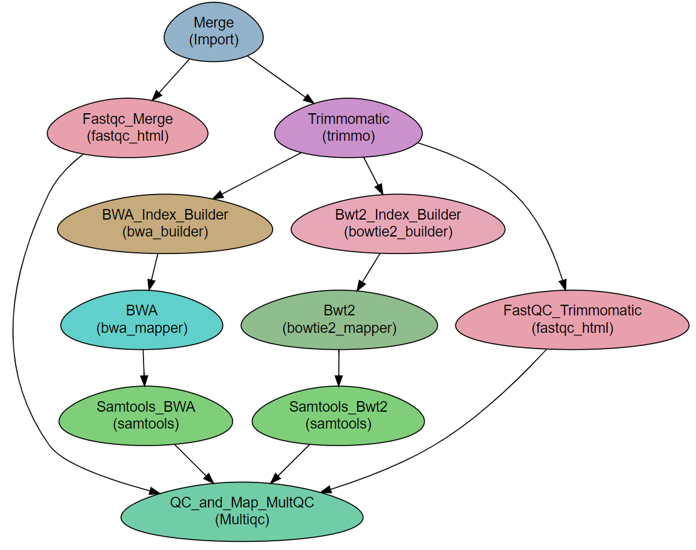

RNA-Seq using a reference genome 
--------------------------------

:Author: Liron Levin
:Affiliation: Bioinformatics Core Facility
:Organization: National Institute of Biotechnology in the Negev, Ben Gurion University.

.. Note:: In order to use this Work-Flow first:

    1. Install `NeatSeq-Flow <https://neatseq-flow.readthedocs.io/en/latest/Installation_guide.html#install-with-script>`_ using conda
    2. Make sure that conda is in your **PATH**.
    
    
.. contents:: Page Contents:
   :depth: 2
   :local:
   :backlinks: top

    
Steps:
~~~~~~~

1. **Merge** Decompression and Concatenation (IF NEADED) of read files into single files per direction.
2. **FastQC_Merge** Quality tests on the original reads using FastQC.
3. **MultiQC_pre_trim** Quality report on the original reads using MultiQC.
4. **Trim_Galore**  Reads trimming using Trim_Galore.
5. **FastQC_Trim_Galore** Quality tests on reads after trimming using FastQC.
6. **RSEM_Genome** indexing of the reference genome, mapping of the post trimming reads and count data creation.
7. **MultiQC_post_trim** Quality report on the trimmed reads and mapping information using MultiQC.
    
Workflow Schema
~~~~~~~~~~~~~~~~

.. Note:: It is possible to add a DeSeq2 step for Differential Expression, Clustering and Functional Analyses.
          For more information see the `DESeq2 Tutorial <https://github.com/bioinfo-core-BGU/NeatSeq-Flow_Workflows/blob/master/DeSeq_Workflow/Tutorial.md#differential-expression-deseq2-clustering-and-functional-analyses-tutorial>`_

Requires
~~~~~~~~

 *  Paired end or single-end reads `fastq` files. .
 *  A reference genome in `fasta` format
 *  An annotation file in `gtf` format
 
Programs required
~~~~~~~~~~~~~~~~~~

* `FastQC       <https://www.bioinformatics.babraham.ac.uk/projects/fastqc/>`_
* `Trim-Galore v0.4.5  <https://www.bioinformatics.babraham.ac.uk/projects/trim_galore/>`_
* `Cutadapt v1.15      <https://cutadapt.readthedocs.io/en/stable/guide.html>`_
* `STAR                <https://github.com/alexdobin/STAR>`_
* `Bowtie2             <http://bowtie-bio.sourceforge.net/bowtie2/index.shtml>`_
* `RSEM                <https://github.com/deweylab/RSEM>`_
* `MultiQC             <https://multiqc.info/>`_

.. Note:: The programs are installed as part of the installation process using CONDA.

Example of Sample File
~~~~~~~~~~~~~~~~~~~~~~

::

    Title	RNA_seq

    #SampleID	Type	Path
    Sample1	Forward	/path/to/Sample1_F1.fastq.gz
    Sample1	Forward	/path/to/Sample1_F2.fastq.gz
    Sample1	Reverse	/path/to/Sample1_R1.fastq.gz
    Sample1	Reverse	/path/to/Sample1_R2.fastq.gz
    Sample2	Forward	/path/to/Sample2_F1.fastq.gz
    Sample2	Reverse	/path/to/Sample2_R1.fastq.gz
    Sample2	Forward	/path/to/Sample2_F2.fastq.gz
    Sample2	Reverse	/path/to/Sample2_R2.fastq.gz

Instructions 
~~~~~~~~~~~~~~

**Install all the required programs in to a conda environment:**

   1. Download the RNASeq conda environment installer file:

       .. code-block:: bash

            curl https://raw.githubusercontent.com/bioinfo-core-BGU/neatseq-flow-modules/master/Workflows/RNASeq_env_install.yaml > RNASeq_env_install.yaml
            

    2. Create the RNASeq conda environment:

       .. code-block:: bash

            conda env create -f RNASeq_env_install.yaml

**Download the Work-Flow's Parameter file:**

    Using STAR as the mapper:
    
    .. code-block:: bash

            curl https://raw.githubusercontent.com/bioinfo-core-BGU/neatseq-flow-modules/master/Workflows/RNASeq_STAR.yaml > RNASeq.yaml

    Using Bowtie2 as the mapper:
    
    .. code-block:: bash

            curl https://raw.githubusercontent.com/bioinfo-core-BGU/neatseq-flow-modules/master/Workflows/RNASeq_Bowtie2.yaml > RNASeq.yaml

**Activate the NeatSeq_Flow conda environment:**

   .. code-block:: bash
   
      bash
      source activate NeatSeq_Flow
      
      
**Edit the "Vars" section in the Work-Flow's Parameter file:**
    Specify the location of the gtf and reference genome files
    
    .. Note:: It is recommended to use the NeatSeq-Flow GUI in order to:
        
        * Edit the Work-Flow's **Parameter file** 
        * Create a **Samples file**
        * Generate and run the  Work-Flow's scripts.
        
        .. code-block:: bash
   
            NeatSeq_Flow_GUI.py
            
        Learn more about `How to use NeatSeq-Flow GUI <https://neatseq-flow.readthedocs.io/en/latest/Tutorial.html#learn-how-to-use-the-graphical-user-interface>`_
        
        Alternatively, It is possible to use a text editor. 
        
**Generate the scripts by typing in the command line:**
    
       .. code-block:: bash

            neatseq_flow.py -s Samples_file.nsfs -p RNASeq.yaml
            
**Run the Work-Flow by typing in the command line:**
    
       .. code-block:: bash

            bash  scripts/00.workflow.commands.sh  1> null &
            
**Run the Work-Flow monitor by typing in the command line:**
    
       .. code-block:: bash

            neatseq_flow_monitor.py