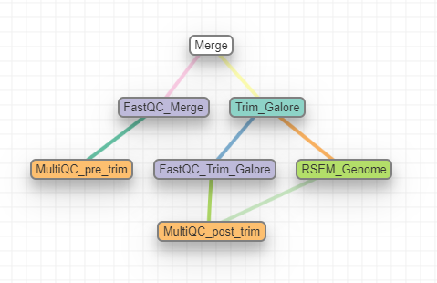

RNA-Seq using a reference genome 
--------------------------------

:Author: Menachem Sklarz
:Affiliation: Bioinformatics Core Facility
:Organization: National Institute of Biotechnology in the Negev, Ben Gurion University.

A pipeline for RNA-seq analysis with a reference genome.
    
This workflow takes reads in `fastq` format, either paired-end or single.

    
Steps:
~~~~~~~

1. Concatenating the read files into single files per direction (``merge``), QC (``fastqc_html``) and trimming (``trimmo``).
2. Mapping of the reads to the reference genome is performed with STAR (``STAR`` module).
3. Creating counts table with htseq-count (``htseq_count`` module)
    
Workflow Schema
~~~~~~~~~~~~~~~~

Requires
~~~~~~~~

`fastq` files. Paired end or single-end.

Programs required
~~~~~~~~~~~~~~~~~~

* `FastQC       <https://www.bioinformatics.babraham.ac.uk/projects/fastqc/>`_
* `trimmomatic  <http://www.usadellab.org/cms/?page=trimmomatic>`_
* `samtools     <http://www.htslib.org/>`_
* `STAR         <https://github.com/alexdobin/STAR>`_
* `htseq-count  <http://htseq.readthedocs.io/en/master/count.html>`_

Example of Sample File
~~~~~~~~~~~~~~~~~~~~~~

::

    Title	RNA_seq_denovo

    #SampleID	Type	Path    lane
    Sample1	Forward	/path/to/Sample1_F1.fastq.gz 1
    Sample1	Forward	/path/to/Sample1_F2.fastq.gz 2
    Sample1	Reverse	/path/to/Sample1_R1.fastq.gz 1
    Sample1	Reverse	/path/to/Sample1_R2.fastq.gz 2
    Sample2	Forward	/path/to/Sample2_F1.fastq.gz 1
    Sample2	Reverse	/path/to/Sample2_R1.fastq.gz 1
    Sample2	Forward	/path/to/Sample2_F2.fastq.gz 2
    Sample2	Reverse	/path/to/Sample2_R2.fastq.gz 2

Download
~~~~~~~~~

The workflow file is available :download:`here <../../../Workflows/RNA_seq_reference.yaml>`

