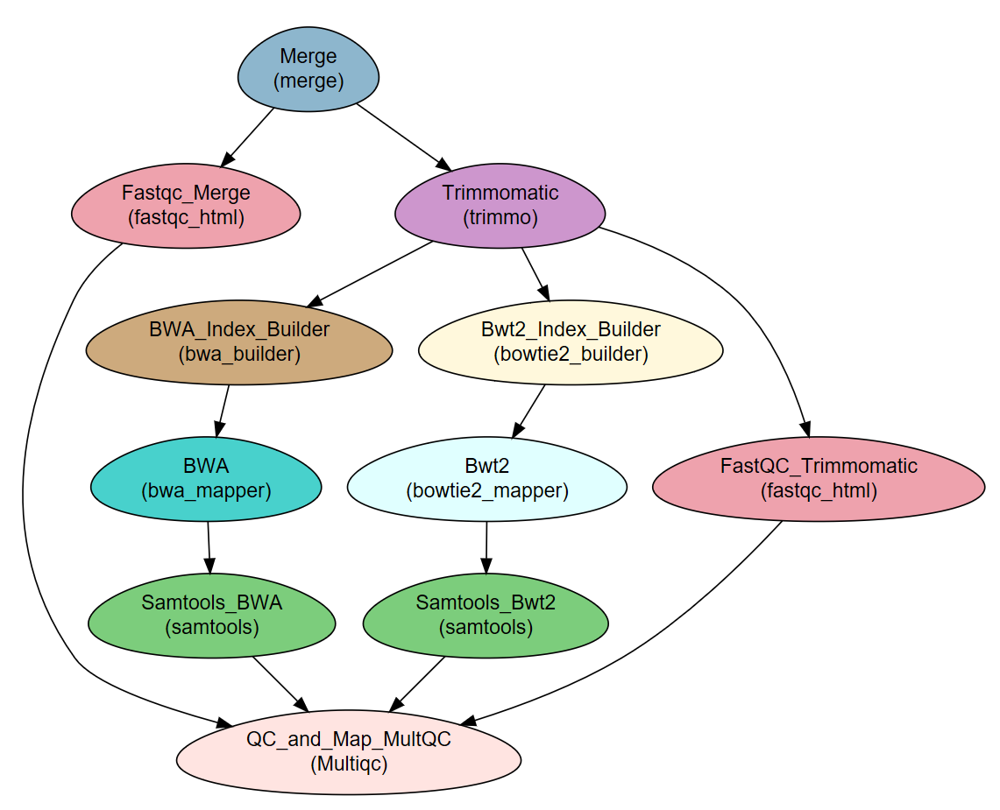

NeatSeq-Flow Tutorial Workflow
----------------------------------------------------------------

:Author: Menachem Sklarz and Liron Levin
:Affiliation: Bioinformatics Core Facility
:Organization: National Institute of Biotechnology in the Negev, Ben Gurion University.

This tutorial describes how to create and execute the workflow described in the **NeatSeq-Flow** manuscript
(`Article on BioRXiv <https://www.biorxiv.org/content/early/2018/12/18/173005>`_).

See `NeatSeq-Flow Tutorial <https://neatseq-flow3.readthedocs.io/en/latest/Tutorial.html>`_ for detailed instructions for quick installation of the tutorial workflow with conda.

The example workflow receives FASTQ files and the sequenced genome of a bacteria. It then performs:

* Quality testing and trimming of the raw sequence reads (paired- or single-end).
* Alignment (“mapping”) of the reads to a reference genome using two different programs.
* Sorting the samples' BAM files as final results.
* Creation of a report on reads and mapping quality.

Workflow Schema
~~~~~~~~~~~~~~~~~~~~~~

Steps:
~~~~~~~

.. csv-table::
    :header: "Step", "Module", "Program"
    :widths: 15, 10, 10

    "Merge","merge","-"
    "Fastqc_Merge","fastqc_html","fastqc"
    "Trimmomatic","trimmo","trimmomatic"
    "FastQC_Trimmomatic","fastqc_html","fastqc"
    "BWA_Index_Builder","bwa_builder","bwa"
    "BWA","bwa_mapper","bwa"
    "Bwt2_Index_Builder","bowtie2_builder","bowtie2"
    "Bwt2","bowtie2_mapper","bowtie2"
    "Samtools_BWA","samtools","samtools"
    "Samtools_Bwt2","samtools","samtools"
    "QC_and_Map_MultQC","Multiqc","MultiQC"

Required data
~~~~~~~~~~~~~~~~

This WF requires samples with ``fastq`` file(s) (paired or single) and a reference genome in ``fasta`` format.

Programs required
~~~~~~~~~~~~~~~~~~

* fastqc
* trimmomatic
* multiqc
* samtools=1.3
* BWA
* bowtie2

Example of Sample File
~~~~~~~~~~~~~~~~~~~~~~

::

   Title	Example_WF_From_the_manuscript

   #Type	Path
   Nucleotide	/path/to/Reference_genome.fasta

   #SampleID	Type	Path
   Sample1	Forward	/path/to/Sample1.F.fastq.gz
   Sample1	Reverse	/path/to/Sample1.R.fastq.gz
   Sample2	Forward	/path/to/Sample2.F.fastq.gz
   Sample2	Reverse	/path/to/Sample2.R.fastq.gz
   Sample3	Forward	/path/to/Sample3.F.fastq.gz
   Sample3	Reverse	/path/to/Sample3.R.fastq.gz

Download
~~~~~~~~~

.. code-block:: bash

   curl https://raw.githubusercontent.com/bioinfo-core-BGU/neatseq-flow-tutorial/master/Samples_conda.nsfs > Tutorial_Samples_file.nsfs

   curl https://raw.githubusercontent.com/bioinfo-core-BGU/neatseq-flow-tutorial/master/Example_WF_conda_env.yaml > Tutorial_Parameter_file.yaml
