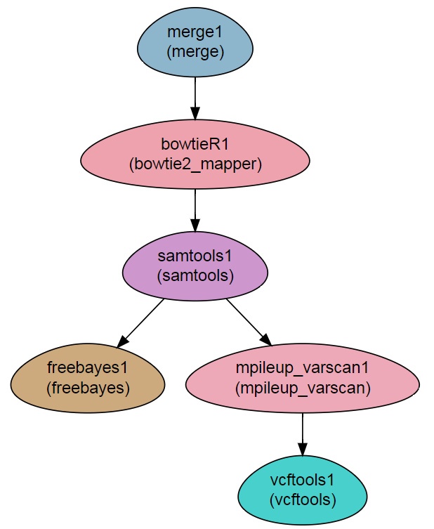

Variant calling
---------------------

This workflow performs a basic variant-calling analysis.

Steps:
~~~~~~~

1. Merging the fastq sequences into a single file per sample (``merge``)
2. Mapping to a reference genome with bowtie2 (``bowtie2`` module)
3. Sorting, filtering and conversion to BAM with samtools (``samtools`` module)
4. Variant calling with two programs:
    a. freebayes  (``freebayes`` module)
    b. mpileup and varscan  (``mpileup_varscan`` module)
5. Analysis of the resulting VCF file with VCFtools (``vcftools`` module).
    
    
DAG
~~~

Requires
~~~~~~~~

* `fastq` files, either paired-end or single-end.

Programs required
~~~~~~~~~~~~~~~~~~

* `FastQC       <https://www.bioinformatics.babraham.ac.uk/projects/fastqc/>`_
* `trimmomatic  <http://www.usadellab.org/cms/?page=trimmomatic>`_
* `bowtie2      <http://bowtie-bio.sourceforge.net/bowtie2/index.shtml>`_
* `samtools     <http://www.htslib.org/>`_
* `freebayes    <https://github.com/ekg/freebayes>`_
* `varscan      <http://varscan.sourceforge.net/>`_
* `VCFtools     <https://vcftools.github.io>`_

Example of Sample File
~~~~~~~~~~~~~~~~~~~~~~

::

    Title	ChIP_project

    #SampleID	Type	Path    lane
    Sample1	Forward	/path/to/Sample1_F1.fastq.gz 1
    Sample1	Forward	/path/to/Sample1_F2.fastq.gz 2
    Sample1	Reverse	/path/to/Sample1_R1.fastq.gz 1
    Sample1	Reverse	/path/to/Sample1_R2.fastq.gz 2
    Sample2	Forward	/path/to/Sample2_F1.fastq.gz 1
    Sample2	Reverse	/path/to/Sample2_R1.fastq.gz 1
    Sample2	Forward	/path/to/Sample2_F2.fastq.gz 2
    Sample2	Reverse	/path/to/Sample2_R2.fastq.gz 2

Download
~~~~~~~~~

The workflow file is available :download:`here <../../../Workflows/variant_calling.yaml>`

    
    